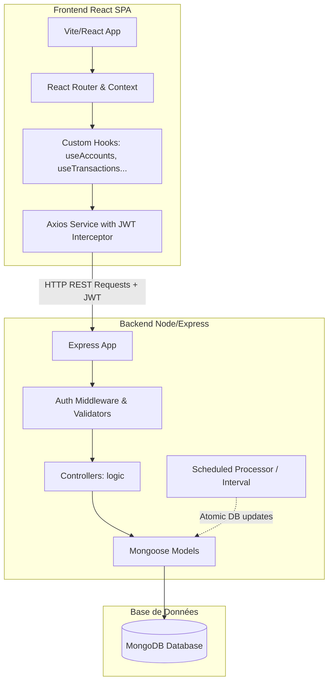

# Documentation Technique — Budgetizer 🛠️

Cette documentation détaille l'architecture logicielle, la structure de la base de données, la spécification des API et les mécanismes système de Budgetizer.

---

## 1. Architecture Globale

Budgetizer repose sur une architecture découplée Client-Serveur (SPA + REST API) :

---

## 2. Modèles de Données Mongoose (Database Schema)

Les données sont stockées dans MongoDB. Voici les schémas définis avec Mongoose :

### 2.1 Modèle `User` (Utilisateurs)
Représente les informations de compte et les préférences d'affichage.
- `email` (String, unique, requis) : Adresse e-mail en minuscules.
- `password` (String, requis) : Mot de passe haché (bcryptjs).
- `name` (String, requis) : Nom de l'utilisateur.
- `currency` (Object) : Code devise (default: 'EUR') et symbole (default: '€').
- `preferences` (Object) :
  - `theme` (String, enum: `['dark', 'light', 'system']`, default: 'dark').
  - `dateFormat` (String, default: 'DD/MM/YYYY').
  - `language` (String, default: 'fr').
  - `firstDayOfWeek` (Number, default: 1 - Lundi).
- `createdAt` (Date, default: Date.now).

### 2.2 Modèle `Account` (Comptes)
Représente un compte bancaire ou un portefeuille d'actifs.
- `userId` (ObjectId -> User, requis) : Propriétaire du compte.
- `name` (String, requis) : Nom du compte.
- `type` (String, enum: `['checking', 'savings', 'cash', 'credit', 'investment']`, requis).
- `balance` (Number, default: 0) : Solde en temps réel.
- `currency` (String, default: "EUR").
- `color` (String, default: "#4ade80") : Couleur hexadécimale associée.
- `icon` (String, default: "wallet").
- `includeInTotal` (Boolean, default: true) : Indique s'il est cumulé dans le solde total net.
- `creditLimit` (Number, default: null) : Limite autorisée (si type = `credit`).
- `order` (Number, default: 0) : Ordre d'affichage dans le carrousel.

### 2.3 Modèle `Category` (Catégories)
Gère l'arborescence des types de flux financiers.
- `userId` (ObjectId -> User, requis).
- `name` (String, requis).
- `type` (String, enum: `['expense', 'income', 'both']`, requis).
- `icon` (String, requis) et `color` (String, requis).
- `parentId` (ObjectId -> Category, default: null) : Référence à la catégorie parente pour gérer des sous-catégories.
- `isDefault` (Boolean, default: false) : Indicateur système (ex: catégories pré-remplies).
- `order` (Number, default: 0).

### 2.4 Modèle `Transaction` (Transactions réelles)
Enregistre chaque mouvement financier.
- `userId` (ObjectId -> User, requis).
- `accountId` (ObjectId -> Account, requis) : Compte affecté.
- `categoryId` (ObjectId -> Category, requis sauf virement).
- `type` (String, enum: `['expense', 'income', 'transfer']`, requis).
- `amount` (Number, requis, min: 0.01).
- `description` (String, default: "").
- `date` (Date, default: Date.now, requis).
- `note` (String, default: "").
- `tags` ([String]).
- `isScheduled` (Boolean, default: false) : Vrai si généré par le planificateur.
- `scheduledTransactionId` (ObjectId -> ScheduledTransaction, default: null).
- `isPending` (Boolean, default: false) : En attente d'approbation si `autoConfirm = false`.
- `toAccountId` (ObjectId -> Account, default: null) : Compte cible (uniquement si type = `transfer`).

### 2.5 Modèle `ScheduledTransaction` (Transactions Planifiées / Abonnements)
Contient le patron de récurrence pour générer automatiquement les transactions.
- `userId`, `accountId`, `categoryId`, `toAccountId` (ObjectIds).
- `type` (`'expense' | 'income' | 'transfer'`).
- `amount` (Number), `description` (String), `note` (String).
- `frequency` (Object, requis) :
  - `every` (Number, default: 1) : Pas de répétition (ex: toutes les *x* unités).
  - `unit` (String, enum: `['day', 'week', 'month', 'year']`).
- `startDate` (Date, requis) : Date de départ de la récurrence.
- `nextDate` (Date, requis) : Date exacte de la prochaine occurrence planifiée.
- `endDate` (Date, default: null).
- `numberOfTimes` (Number, default: 0) : Nombre limite d'occurrences (0 = infini).
- `timesExecuted` (Number, default: 0) : Compteur d'exécutions passées.
- `autoConfirm` (Boolean, default: true) : Si faux, génère une transaction avec `isPending: true` au lieu de modifier le solde directement.
- `isSubscription` (Boolean, default: false) : Flag pour isoler l'affichage dans l'onglet abonnements.
- `isActive` (Boolean, default: true) : Flag pour suspendre la planification.

### 2.6 Modèle `Budget` (Budgets par Enveloppes)
- `userId` (ObjectId -> User, requis).
- `name` (String, requis).
- `categoryId` (ObjectId -> Category, requis).
- `amount` (Number, requis, min: 0.01).
- `period` (String, enum: `['weekly', 'monthly', 'yearly']`, default: 'monthly').
- `startDate` (Date, default: Date.now).
- `rollover` (Boolean, default: false) : Permet de reporter le reste ou le déficit sur la période suivante.
- `alertAt` (Number, default: 80) : Pourcentage de dépense déclenchant une alerte.
- `color` (String, default: '#8b5cf6').

---

## 3. Spécification de l'API REST

Toutes les routes d'API (sauf `/api/auth/login` et `/api/auth/register`) nécessitent le middleware `protect` pour valider le jeton JWT transmis via le header `Authorization: Bearer <token>`.

### 3.1 Authentification (`/api/auth`)
- `POST /register` : Crée un utilisateur et retourne un jeton JWT.
- `POST /login` : Vérifie l'e-mail/mot de passe et retourne un jeton JWT.
- `GET /me` : Retourne l'utilisateur actuellement connecté (via son ID décodé du jeton).

### 3.2 Comptes (`/api/accounts`)
- `GET /` : Liste tous les comptes de l'utilisateur (ordonnés par `order`).
- `POST /` : Crée un nouveau compte.
- `PUT /:id` : Modifie un compte existant.
- `DELETE /:id` : Supprime un compte (supprime aussi les transactions liées ou réaffecte si nécessaire).

### 3.3 Catégories (`/api/categories`)
- `GET /` : Liste toutes les catégories de l'utilisateur (incluant les catégories par défaut).
- `POST /` : Crée une catégorie.
- `PUT /:id` : Modifie une catégorie.
- `DELETE /:id` : Supprime une catégorie.

### 3.4 Transactions (`/api/transactions`)
- `GET /` : Liste paginée/filtrée des transactions de l'utilisateur (recherche par mot-clé, tags, plage de dates).
- `GET /calendar` : Retourne les transactions pour une vue calendrier.
- `GET /export` : Exporte les transactions au format CSV.
- `POST /import` : Importe des transactions depuis un fichier via le middleware `multer`.
- `POST /` : Crée une transaction (Met à jour le solde du ou des comptes impliqués).
- `PUT /:id` : Modifie une transaction (Recalcule le solde des comptes).
- `DELETE /:id` : Supprime une transaction (Annule l'effet sur le solde des comptes).

### 3.5 Budgets (`/api/budgets`)
- `GET /` : Liste des budgets de l'utilisateur avec indicateurs de dépenses actuelles calculées à la volée.
- `POST /` : Crée un budget.
- `PUT /:id` : Modifie un budget.
- `DELETE /:id` : Supprime un budget.

### 3.6 Transactions Planifiées (`/api/scheduled`)
- `GET /` : Liste des planifications actives.
- `GET /subscriptions` : Liste spécifique des abonnements et coûts cumulés.
- `POST /` : Crée une planification (Calcule la première échéance `nextDate`).
- `PUT /:id` : Modifie une planification.
- `DELETE /:id` : Annule/supprime une planification.
- `POST /:id/confirm` : Valide manuellement une transaction planifiée marquée en `pending` (met à jour le solde et passe `isPending` à faux).

### 3.7 Tableau de bord & Statistiques (`/api/dashboard` & `/api/charts`)
- `GET /api/dashboard` : Synthèse des soldes, comptes, mini-calendrier hebdomadaire et dernières transactions.
- `GET /api/charts/category` : Répartition catégorielle sur une période.
- `GET /api/charts/forecast` : Calcul de la projection de solde à 30 jours.

---

## 4. Algorithmes et Processus Clés

### 4.1 Orchestrateur de planification (`scheduledProcessor.js`)
Ce module est le moteur d'automatisation de Budgetizer. Il fonctionne selon la boucle d'exécution suivante :
1. **Déclenchement** : Lancé immédiatement au démarrage du serveur Express, puis exécuté périodiquement toutes les heures via un `setInterval`.
2. **Recherche des échéances** : Recherche toutes les `ScheduledTransaction` dont `isActive = true` et `nextDate <= Date.now()`.
3. **Traitement transactionnel (Mongoose Sessions)** :
   - Pour chaque échéance, une session de transaction MongoDB est démarrée. Cela garantit que la création de la transaction financière et la mise à jour des soldes de compte réussissent ensemble ou échouent sans corrompre les données (atomicité).
   - **Écriture de l'historique** : Crée un enregistrement `Transaction` avec `isScheduled: true`.
   - **Mise à jour des soldes** :
     - Si `autoConfirm = true` : Modifie les soldes des comptes correspondants (`balance -= amount` pour dépense, `+= amount` pour revenu, et les deux pour un transfert).
     - Si `autoConfirm = false` : La transaction est créée avec `isPending: true`, aucun solde n'est modifié tant que l'utilisateur n'approuve pas via l'API `/confirm`.
   - **Calcul de la récurrence suivante** :
     La fonction `calculateNextDate` détermine le prochain point de passage :
     $$\text{nextDate} = \text{nextDate} + (\text{every} \times \text{unit})$$
   - **Vérification des limites** :
     - Si le compteur `timesExecuted` atteint `numberOfTimes` ou si `nextDate` dépasse `endDate`, la planification est marquée `isActive = false`.
   - **Validation** : Validation de la session (`commitTransaction()`).

---

## 5. Architecture du Frontend (Client React)

### 5.1 Sécurité et Session
L'état d'authentification est globalisé via le composant [AuthContext](file:///c:/Projects/budgetizer/client/src/context/AuthContext.jsx).
- Le jeton JWT est enregistré dans le `localStorage` lors de la connexion.
- Une instance d'Axios personnalisée ([api.js](file:///c:/Projects/budgetizer/client/src/services/api.js)) intercepte chaque requête sortante pour y injecter le header `Authorization: Bearer <token>`.
- Si le serveur répond avec un code HTTP `401 Unauthorized` (ex: jeton expiré), le réponse-intercepteur vide le stockage local et redirige vers la page `/login`.

### 5.2 Hooks Personnalisés (Custom Hooks)
Le client sépare la logique de gestion d'état et d'appel réseau des composants graphiques grâce à des hooks spécifiques localisés dans `client/src/hooks/` :
- `useAccounts.js` : CRUD sur les comptes.
- `useTransactions.js` : Recherche, filtres, import/export et ajout de transactions.
- `useBudgets.js` : Suivi et définition des enveloppes de budget.
- `useScheduled.js` : Gestion des transactions planifiées.
- `useDashboard.js` : Agrégation des données de la page d'accueil.
- `useMonthlySummaries.js` : Historique des soldes par mois passés.
