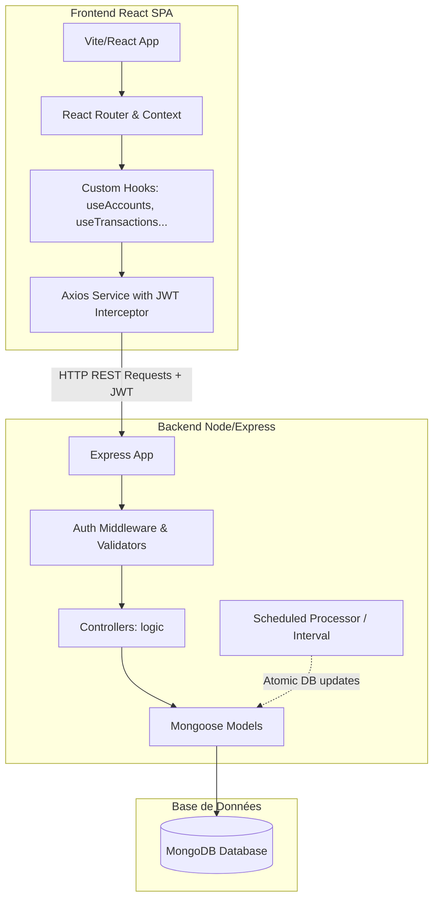

# Documentation Technique — Budgetizer 🛠️

Cette documentation détaille l'architecture logicielle, la structure de la base de données, la spécification des API et les mécanismes système de Budgetizer.

---

## 1. Architecture Globale

Budgetizer repose sur une architecture découplée Client-Serveur (SPA + REST API) :



---

## 2. Modèles de Données Mongoose (Database Schema)

Les données sont stockées dans MongoDB. Voici les schémas définis avec Mongoose :

### 2.1 Modèle `User` (Utilisateurs)
Représente les informations de compte et les préférences d'affichage.
- `email` (String, unique, requis) : Adresse e-mail en minuscules.
- `password` (String, requis) : Mot de passe haché (bcryptjs).
- `name` (String, requis) : Nom de l'utilisateur.
- `currency` (Object) : Code devise (default: 'EUR') et symbole (default: '€').
- `preferences` (Object) :
  - `theme` (String, enum: `['dark', 'light', 'system']`, default: 'dark').
  - `dateFormat` (String, default: 'DD/MM/YYYY').
  - `language` (String, default: 'fr').
  - `firstDayOfWeek` (Number, default: 1 - Lundi).
  - `anomalyThreshold` (Number, default: 30) : Seuil de détection d'anomalies en pourcentage.
- `createdAt` (Date, default: Date.now).

### 2.2 Modèle `Account` (Comptes)
Représente un compte bancaire ou un portefeuille d'actifs.
- `userId` (ObjectId -> User, requis) : Propriétaire du compte.
- `name` (String, requis) : Nom du compte.
- `type` (String, enum: `['checking', 'savings', 'cash', 'credit', 'investment']`, requis).
- `balance` (Number, default: 0) : Solde en temps réel.
- `currency` (String, default: "EUR").
- `color` (String, default: "#4ade80") : Couleur hexadécimale associée.
- `icon` (String, default: "wallet").
- `includeInTotal` (Boolean, default: true) : Indique s'il est cumulé dans le solde total net.
- `creditLimit` (Number, default: null) : Limite autorisée (si type = `credit`).
- `order` (Number, default: 0) : Ordre d'affichage dans le carrousel.

### 2.3 Modèle `Category` (Catégories)
Gère l'arborescence des types de flux financiers.
- `userId` (ObjectId -> User, requis).
- `name` (String, requis).
- `type` (String, enum: `['expense', 'income', 'both']`, requis).
- `icon` (String, requis) et `color` (String, requis).
- `parentId` (ObjectId -> Category, default: null) : Référence à la catégorie parente pour gérer des sous-catégories.
- `isDefault` (Boolean, default: false) : Indicateur système (ex: catégories pré-remplies).
- `order` (Number, default: 0).

### 2.4 Modèle `Transaction` (Transactions réelles)
Enregistre chaque mouvement financier.
- `userId` (ObjectId -> User, requis).
- `accountId` (ObjectId -> Account, requis) : Compte affecté.
- `categoryId` (ObjectId -> Category, requis sauf virement).
- `type` (String, enum: `['expense', 'income', 'transfer']`, requis).
- `amount` (Number, requis, min: 0.01).
- `description` (String, default: "").
- `date` (Date, default: Date.now, requis).
- `note` (String, default: "").
- `tags` ([String]).
- `isScheduled` (Boolean, default: false) : Vrai si généré par le planificateur.
- `scheduledTransactionId` (ObjectId -> ScheduledTransaction, default: null).
- `isPending` (Boolean, default: false) : En attente d'approbation si `autoConfirm = false`.
- `toAccountId` (ObjectId -> Account, default: null) : Compte cible (uniquement si type = `transfer`).

### 2.5 Modèle `ScheduledTransaction` (Transactions Planifiées / Abonnements)
Contient le patron de récurrence pour générer automatiquement les transactions.
- `userId`, `accountId`, `categoryId`, `toAccountId` (ObjectIds).
- `type` (`'expense' | 'income' | 'transfer'`).
- `amount` (Number), `description` (String), `note` (String).
- `frequency` (Object, requis) :
  - `every` (Number, default: 1) : Pas de répétition (ex: toutes les *x* unités).
  - `unit` (String, enum: `['day', 'week', 'month', 'year']`).
- `startDate` (Date, requis) : Date de départ de la récurrence.
- `nextDate` (Date, requis) : Date exacte de la prochaine occurrence planifiée.
- `endDate` (Date, default: null).
- `numberOfTimes` (Number, default: 0) : Nombre limite d'occurrences (0 = infini).
- `timesExecuted` (Number, default: 0) : Compteur d'exécutions passées.
- `autoConfirm` (Boolean, default: true) : Si faux, génère une transaction avec `isPending: true` au lieu de modifier le solde directement.
- `isSubscription` (Boolean, default: false) : Flag pour isoler l'affichage dans l'onglet abonnements.
- `isActive` (Boolean, default: true) : Flag pour suspendre la planification.

### 2.6 Modèle `Budget` (Budgets par Enveloppes)
- `userId` (ObjectId -> User, requis).
- `name` (String, requis).
- `categoryId` (ObjectId -> Category, requis).
- `amount` (Number, requis, min: 0.01).
- `period` (String, enum: `['weekly', 'monthly', 'yearly']`, default: 'monthly').
- `startDate` (Date, default: Date.now).
- `rollover` (Boolean, default: false) : Permet de reporter le reste ou le déficit sur la période suivante.
- `alertAt` (Number, default: 80) : Pourcentage de dépense déclenchant une alerte.
- `color` (String, default: '#8b5cf6').

---

## 3. Spécification de l'API REST

Toutes les routes d'API (sauf `/api/auth/login` et `/api/auth/register`) nécessitent le middleware `protect` pour valider le jeton JWT transmis via le header `Authorization: Bearer <token>`.

### 3.1 Authentification (`/api/auth`)
- `POST /register` : Crée un utilisateur et retourne un jeton JWT.
- `POST /login` : Vérifie l'e-mail/mot de passe et retourne un jeton JWT.
- `GET /me` : Retourne l'utilisateur actuellement connecté (via son ID décodé du jeton).

### 3.2 Comptes (`/api/accounts`)
- `GET /` : Liste tous les comptes de l'utilisateur (ordonnés par `order`).
- `POST /` : Crée un nouveau compte.
- `PUT /:id` : Modifie un compte existant.
- `DELETE /:id` : Supprime un compte (supprime aussi les transactions liées ou réaffecte si nécessaire).

### 3.3 Catégories (`/api/categories`)
- `GET /` : Liste toutes les catégories de l'utilisateur (incluant les catégories par défaut).
- `POST /` : Crée une catégorie.
- `PUT /:id` : Modifie une catégorie.
- `DELETE /:id` : Supprime une catégorie.

### 3.4 Transactions (`/api/transactions`)
- `GET /` : Liste paginée/filtrée des transactions de l'utilisateur (recherche par mot-clé, tags, plage de dates).
- `GET /calendar` : Retourne les transactions pour une vue calendrier.
- `GET /export` : Exporte les transactions au format CSV.
- `POST /import` : Importe des transactions depuis un fichier via le middleware `multer`.
- `POST /` : Crée une transaction (Met à jour le solde du ou des comptes impliqués).
- `PUT /:id` : Modifie une transaction (Recalcule le solde des comptes).
- `DELETE /:id` : Supprime une transaction (Annule l'effet sur le solde des comptes).

### 3.5 Budgets (`/api/budgets`)
- `GET /` : Liste des budgets de l'utilisateur avec indicateurs de dépenses actuelles calculées à la volée.
- `POST /` : Crée un budget.
- `PUT /:id` : Modifie un budget.
- `DELETE /:id` : Supprime un budget.

### 3.6 Transactions Planifiées (`/api/scheduled`)
- `GET /` : Liste des planifications actives.
- `GET /subscriptions` : Liste spécifique des abonnements et coûts cumulés.
- `POST /` : Crée une planification (Calcule la première échéance `nextDate`).
- `PUT /:id` : Modifie une planification.
- `DELETE /:id` : Annule/supprime une planification.
- `POST /:id/confirm` : Valide manuellement une transaction planifiée marquée en `pending` (met à jour le solde et passe `isPending` à faux).

### 3.7 Tableau de bord & Statistiques (`/api/dashboard` & `/api/charts`)
- `GET /api/dashboard` : Synthèse des soldes, comptes, mini-calendrier hebdomadaire et dernières transactions.
- `GET /api/charts/category` : Répartition catégorielle sur une période.
- `GET /api/charts/forecast` : Calcul de la projection de solde à 30 jours.

### 3.8 IA & Insights (`/api/insights`)
- `GET /` : Retourne la liste des anomalies détectées (selon le seuil spécifié) et le top 3 des suggestions de réductions budgétaires avec alertes d'abonnements.

---

## 4. Algorithmes et Processus Clés

### 4.1 Orchestrateur de planification (`scheduledProcessor.js`)
Ce module est le moteur d'automatisation de Budgetizer. Il fonctionne selon la boucle d'exécution suivante :
1. **Déclenchement** : Lancé immédiatement au démarrage du serveur Express, puis exécuté périodiquement toutes les heures via un `setInterval`.
2. **Recherche des échéances** : Recherche toutes les `ScheduledTransaction` dont `isActive = true` et `nextDate <= Date.now()`.
3. **Traitement transactionnel (Mongoose Sessions)** :
   - Pour chaque échéance, une session de transaction MongoDB est démarrée. Cela garantit que la création de la transaction financière et la mise à jour des soldes de compte réussissent ensemble ou échouent sans corrompre les données (atomicité).
   - **Écriture de l'historique** : Crée un enregistrement `Transaction` avec `isScheduled: true`.
   - **Mise à jour des soldes** :
     - Si `autoConfirm = true` : Modifie les soldes des comptes correspondants (`balance -= amount` pour dépense, `+= amount` pour revenu, et les deux pour un transfert).
     - Si `autoConfirm = false` : La transaction est créée avec `isPending: true`, aucun solde n'est modifié tant que l'utilisateur n'approuve pas via l'API `/confirm`.
   - **Calcul de la récurrence suivante** :
     La fonction `calculateNextDate` détermine le prochain point de passage :
     $$\text{nextDate} = \text{nextDate} + (\text{every} \times \text{unit})$$
   - **Vérification des limites** :
     - Si le compteur `timesExecuted` atteint `numberOfTimes` ou si `nextDate` dépasse `endDate`, la planification est marquée `isActive = false`.
    - `Validation` : Validation de la session (`commitTransaction()`).

### 4.2 Détection d'Anomalies et Prévisions d'Insights (`insightController.js`)
Cet algorithme est invoqué à la demande lors du rendu de la page « Conseils » :
1. **Identification des mois complets historiques** : Détermine les 3 derniers mois complets relatifs à la date du jour (ex: si nous sommes en mai, les mois historiques sont février, mars et avril).
2. **Calcul de l'âge d'activité** : Vérifie l'ancienneté de l'utilisateur par rapport à sa première transaction. Si celle-ci remonte à moins de 2 mois, l'analyse est ignorée (historique insuffisant).
3. **Moyennes catégorielles historiques** : Agrège les dépenses historiques de l'utilisateur par catégorie et par mois. Si une catégorie n'est présente que sur un seul mois de la période historique, elle est exclue. La moyenne mensuelle de dépense de chaque catégorie valide est calculée sur le nombre de mois d'activité historique du compte (2 ou 3).
4. **Calcul de dérive du mois en cours** : Calcule le total des dépenses du mois en cours pour chaque catégorie et compare cette somme avec la moyenne historique. Si le ratio dépasse $$1 + \text{threshold}$$, une anomalie est générée et classée par gravité (orange pour +30-60%, rouge pour >= +60%).
5. **Calcul de suggestions et détection d'abonnements** : Identifie les 3 catégories où les dépenses cumulées historiques sont les plus élevées. Projette l'économie annuelle pour des diminutions de budget de 10%, 20% et 30%. Analyse si ces catégories contiennent des planifications d'abonnements actives ou passées pour générer un message d'alerte spécifique.

---

## 5. Architecture du Frontend (Client React)

### 5.1 Sécurité et Session
L'état d'authentification est globalisé via le composant [AuthContext](file:///c:/Projects/budgetizer/client/src/context/AuthContext.jsx).
- Le jeton JWT est enregistré dans le `localStorage` lors de la connexion.
- Une instance d'Axios personnalisée ([api.js](file:///c:/Projects/budgetizer/client/src/services/api.js)) intercepte chaque requête sortante pour y injecter le header `Authorization: Bearer <token>`.
- Si le serveur répond avec un code HTTP `401 Unauthorized` (ex: jeton expiré), le réponse-intercepteur vide le stockage local et redirige vers la page `/login`.

### 5.2 Hooks Personnalisés (Custom Hooks)
Le client sépare la logique de gestion d'état et d'appel réseau des composants graphiques grâce à des hooks spécifiques localisés dans `client/src/hooks/` :
- `useAccounts.js` : CRUD sur les comptes.
- `useTransactions.js` : Recherche, filtres, import/export et ajout de transactions.
- `useBudgets.js` : Suivi et définition des enveloppes de budget.
- `useScheduled.js` : Gérant les transactions planifiées.
- `useDashboard.js` : Agrégation des données de la page d'accueil.
- `useMonthlySummaries.js` : Historique des soldes par mois passés.

### 5.3 Intégration PWA & Gestion de l'Installation
Le support Progressive Web App est configuré via `@vite-pwa/plugin` dans `client/vite.config.js` :
- **Service Worker** : Enregistré automatiquement au point d'entrée (`main.jsx`). Il gère le pré-mise en cache (precaching) des actifs statiques (HTML, JS, CSS, images, icônes) pour un démarrage instantané et un fonctionnement en mode hors connexion partiel.
- **Cycle de Vie** : Défini en mode `autoUpdate` pour appliquer immédiatement les nouvelles versions de l'application.
- **PwaContext (`PwaContext.jsx`)** :
  - Intercepte l'événement `beforeinstallprompt` du navigateur pour stocker l'objet d'installation différé.
  - Détecte si l'application s'exécute en mode autonome (PWA installée sur l'appareil) ou via un navigateur standard.
  - Détecte spécifiquement iOS pour fournir des instructions d'installation personnalisées adaptées à Safari.
  - Expose la méthode `installApp()` qui déclenche l'installation native.
- **OfflineStatus (`OfflineStatus.jsx`)** :
  - Surveille les événements de connexion globaux `window.addEventListener('online')` et `window.addEventListener('offline')`.
  - Affiche un bandeau d'alerte animé avec `framer-motion` indiquant le passage hors ligne ou le rétablissement de la connexion.

### 5.4 Expérience Utilisateur & Design System Premium
- **Tiroir de Navigation (`MenuSheet.jsx`)** : Un menu coulissant moderne est déployé de manière fluide grâce à `framer-motion` (physique de ressort). Il utilise un fond flouté (`backdrop-blur-md`) et deux halos de lumière diffuse (`blur-[60px] bg-accent/5` et `bg-purple/5`) placés de manière asymétrique pour créer un effet de profondeur et de relief. Les liens de menu disposent de micro-animations de translation latérale au survol et d'indicateurs d'état actif.
- **Liste Optimisée des Transactions (`TransactionList.jsx`)** : Le composant a été restructuré pour s'adapter dynamiquement aux contraintes mobiles :
  - Sur mobile, le nom du compte bancaire se décale sous le libellé de catégorie (empilement flex-col) afin de libérer la largeur maximale.
  - Les libellés longs sont tronqués proprement (`truncate`) avec affichage d'un attribut de texte au survol (`title`) pour l'accessibilité.
  - Réduction des rembourrages internes (`p-3 sm:p-4`) et de la taille de police pour maximiser le contenu utile.
- **Branding Systémique** : Suppression des logos et icônes génériques de portefeuille. Le logo de l'application (`/pwa-192x192.png`) a été standardisé sur les écrans suivants :
  - `Splash.jsx` (Écran de chargement initial).
  - Écrans d'authentification (`Login.jsx`, `Register.jsx`, `ForgotPassword.jsx`, `ResetPassword.jsx`).

---

## 6. Sécurité, Robustesse et Architecture Production (Backend)

Pour préparer le déploiement en production, le backend a fait l'objet d'une phase de durcissement (security hardening) et de modularisation.

### 6.1 Sécurité Applicative (Middlewares)
- **Helmet (`helmet`)** : Sécurise l'API en définissant divers en-têtes HTTP (X-Content-Type-Options, X-Frame-Options, CSP, HSTS, etc.) protégeant contre le clickjacking et autres vulnérabilités courantes.
- **Rate Limiting (`express-rate-limit`)** : Protège contre les attaques de force brute et de déni de service (DoS). Il limite chaque adresse IP à un nombre de requêtes configurable via la variable `RATE_LIMIT_MAX_REQUESTS` (80 par défaut) sur une fenêtre glissante de 1 minute.
- **MongoDB Sanitization (`express-mongo-sanitize`)** : Élimine les caractères réservés (comme `$` ou `.`) des requêtes HTTP (`req.body`, `req.params`, `req.headers` et `req.query`) afin de prévenir les injections de requêtes NoSQL.
  - *Note technique* : Express v5 ayant rendu le dictionnaire `req.query` en lecture seule, un middleware d'adaptation redéfinit cette propriété comme modifiable avant d'invoquer le désinfecteur.
- **Origines CORS Dynamiques** : Au lieu d'autoriser toutes les requêtes (`*`), CORS vérifie chaque origine entrante par rapport à une liste blanche déclarée dans la variable d'environnement `ALLOWED_ORIGINS`. En mode développement, les requêtes issues de localhost sont automatiquement admises.

### 6.2 Gestion des Connexions et Arrêt Propre (Graceful Shutdown)
- **Pool de Connexion MongoDB** : Utilisation de l'option Mongoose `maxPoolSize` (configurable via `MONGODB_MAX_POOL_SIZE`, défaut 10) pour limiter et réguler la consommation de ressources de base de données.
- **Arrêt Net** : L'API capture les signaux système `SIGTERM` et `SIGINT` (émis par Docker, PM2 ou le système d'exploitation). À la réception de ces signaux :
  1. Le serveur HTTP cesse d'accepter de nouvelles requêtes.
  2. Les connexions en cours sont finalisées (timeout de sécurité de 10s).
  3. La connexion Mongoose à MongoDB est fermée proprement.
  4. Le processus se termine avec le code `0` pour éviter de corrompre des données ou de laisser des ports réseau orphelins.

### 6.3 Déploiement Multi-Processus avec PM2
Dans un environnement de production hautement disponible, le trafic API est distribué sur plusieurs cœurs CPU via le mode `cluster` de PM2. Cependant, lancer plusieurs instances d'API exécutant un planificateur interne (`scheduledProcessor`) provoquerait des exécutions concurrentes en double de transactions planifiées, corrompant les données de solde.

Pour résoudre ce problème, Budgetizer utilise la topologie décrite dans [ecosystem.config.json](file:///c:/Projects/budgetizer/server/ecosystem.config.json) :

```text
                  [ Load Balancer (Nginx/PM2 Cluster) ]
                                   │
                 ┌─────────────────┴─────────────────┐
                 ▼                                   ▼
        [ budgetizer-api #1 ]               [ budgetizer-api #2 ]
        (instances: "max")                  (instances: "max")
       RUN_SCHEDULED_JOBS=false            RUN_SCHEDULED_JOBS=false
                 │                                   │
                 └─────────────────┬─────────────────┘
                                   ▼
                            [ MongoDB DB ]
                                   ▲
                                   │
                        [ budgetizer-worker ]
                           (instances: 1)
                        RUN_SCHEDULED_JOBS=true
```

- **budgetizer-api** : S'exécute en mode `cluster` sur `max` instances. La variable `RUN_SCHEDULED_JOBS` y est positionnée à `false` ; ces instances répondent aux requêtes HTTP de l'API mais n'exécutent pas de boucle de planification.
- **budgetizer-worker** : S'exécute en instance unique (`instances: 1`) en mode `fork`. La variable `RUN_SCHEDULED_JOBS` is positionnée à `true` ; cette instance se consacre exclusivement aux calculs planifiés et à la récurrence sans accepter de trafic web public.

---

## 7. Architecture et Exécution des Tests

Afin de sécuriser le code existant et de prévenir toute régression lors des futurs développements, Budgetizer intègre une suite de tests automatisés couvrant à la fois le client et le serveur.

### 7.1 Framework de Tests : Vitest
**Vitest** est utilisé comme exécuteur de tests unique pour le frontend et le backend en raison de sa rapidité, de sa compatibilité native avec les modules ES (ESM) et de son intégration immédiate avec Vite.

### 7.2 Configuration Client (Frontend)
- **Environnement** : `jsdom` (simule un navigateur dans Node.js).
- **Bibliothèques** : `@testing-library/react` et `@testing-library/jest-dom` pour le rendu des composants React et les assertions DOM.
- **Fichiers de configuration** :
  - [client/vitest.config.js](file:///c:/Projects/budgetizer/client/vitest.config.js) : Déclare l'environnement `jsdom` et charge le fichier de setup.
  - [client/vitest.setup.js](file:///c:/Projects/budgetizer/client/vitest.setup.js) : Importe les utilitaires d'assertion `@testing-library/jest-dom`.
- **Fichiers de tests** : Localisés dans des dossiers `__tests__` à proximité des composants ciblés (ex: [AmountInput.test.jsx](file:///c:/Projects/budgetizer/client/src/components/ui/__tests__/AmountInput.test.jsx)).

### 7.3 Configuration Serveur (Backend)
- **Environnement** : `node` (exécution standard).
- **Stratégie de Mocking** : Les tests du serveur s'exécutent de façon isolée sans base de données physique en mockant :
  - Les modèles Mongoose (`Account`, `Transaction`, `ScheduledTransaction`, `User`, `Category`).
  - Les utilitaires de chiffrement et de signature (`bcryptjs`, `jsonwebtoken`).
- **Fichiers de configuration** :
  - [server/vitest.config.js](file:///c:/Projects/budgetizer/server/vitest.config.js) : Configuration simple pour l'environnement Node.

### 7.4 Commandes d'Exécution
Les scripts npm sont centralisés pour simplifier le travail des développeurs :
- **Lancer tous les tests (Frontend et Backend)** depuis la racine :
  ```bash
  npm run test
  ```
- **Lancer les tests du serveur en mode interactif** :
  ```bash
  npm run test:watch --prefix server
  ```
- **Lancer les tests du client en mode interactif** :
  ```bash
  npm run test:watch --prefix client
  ```

Pour obtenir le détail exhaustif de chaque cas de test (entrées, traitements attendus, assertions), veuillez vous référer à la [Documentation des Tests](file:///c:/Projects/budgetizer/docs/doc_tests.md).

