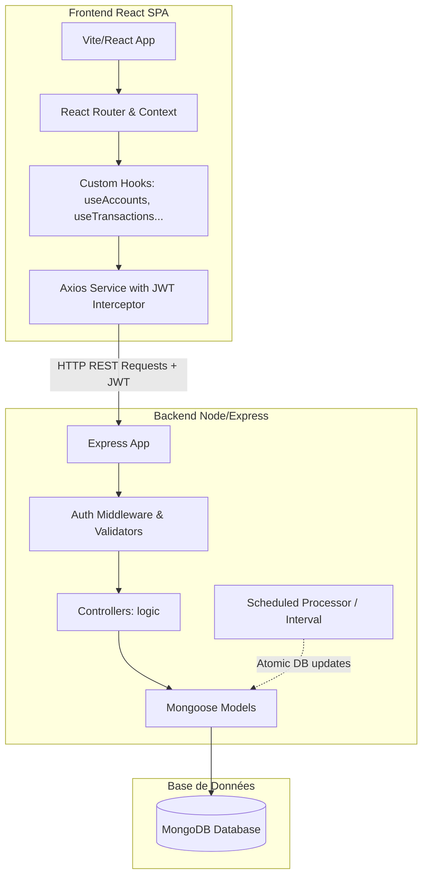

# Documentation Technique — Budgetizer 🛠️

Cette documentation détaille l'architecture logicielle, la structure de la base de données, la spécification des API et les mécanismes système de Budgetizer.

---

## 1. Architecture Globale

Budgetizer repose sur une architecture découplée Client-Serveur (SPA + REST API) :



---

## 2. Modèles de Données Mongoose (Database Schema)

Les données sont stockées dans MongoDB. Voici les schémas définis avec Mongoose :

### 2.1 Modèle `User` (Utilisateurs)
Représente les informations de compte et les préférences d'affichage.
- `email` (String, unique, requis) : Adresse e-mail en minuscules.
- `password` (String, requis) : Mot de passe haché (bcryptjs).
- `name` (String, requis) : Nom de l'utilisateur.
- `currency` (Object) : Code devise (default: 'EUR') et symbole (default: '€').
- `preferences` (Object) :
  - `theme` (String, enum: `['dark', 'light', 'system']`, default: 'dark').
  - `dateFormat` (String, default: 'DD/MM/YYYY').
  - `language` (String, default: 'fr').
  - `firstDayOfWeek` (Number, default: 1 - Lundi).
  - `anomalyThreshold` (Number, default: 30) : Seuil de détection d'anomalies en pourcentage.
- `createdAt` (Date, default: Date.now).

### 2.2 Modèle `Account` (Comptes)
Représente un compte bancaire, un portefeuille d'actifs, ou un crédit amortissable.
- `userId` (ObjectId -> User, requis) : Propriétaire du compte.
- `name` (String, requis) : Nom du compte.
- `type` (String, enum: `['checking', 'savings', 'cash', 'credit', 'investment']`, requis).
- `balance` (Number, default: 0) : Solde en temps réel (initialisé à `-creditDetails.initialAmount` si le type est `credit`).
- `currency` (String, default: "EUR").
- `color` (String, default: "#4ade80") : Couleur hexadécimale associée.
- `icon` (String, default: "wallet").
- `includeInTotal` (Boolean, default: true) : Indique s'il est cumulé dans le solde total net.
- `creditLimit` (Number, default: null) : Limite autorisée (si type = `credit` de l'ancienne spécification).
- `creditDetails` (Object, default: null) : Contient les détails du crédit si `type = 'credit'` :
  - `initialAmount` (Number) : Capital initial emprunté.
  - `interestRate` (Number) : Taux d'intérêt annuel en %.
  - `durationMonths` (Number) : Durée du prêt en mois.
  - `startDate` (Date) : Date de début de l'emprunt (première mensualité).
  - `monthlyPayment` (Number) : Montant de la mensualité calculée.
  - `scheduledTransactionId` (ObjectId -> ScheduledTransaction) : Référence au virement automatique associé.
- `order` (Number, default: 0) : Ordre d'affichage dans le carrousel.

### 2.3 Modèle `Category` (Catégories)
Gère l'arborescence des types de flux financiers.
- `userId` (ObjectId -> User, requis).
- `name` (String, requis).
- `type` (String, enum: `['expense', 'income', 'both']`, requis).
- `icon` (String, requis) et `color` (String, requis).
- `parentId` (ObjectId -> Category, default: null) : Référence à la catégorie parente pour gérer des sous-catégories.
- `isDefault` (Boolean, default: false) : Indicateur système (ex: catégories pré-remplies).
- `order` (Number, default: 0).

### 2.4 Modèle `Transaction` (Transactions réelles)
Enregistre chaque mouvement financier.
- `userId` (ObjectId -> User, requis).
- `accountId` (ObjectId -> Account, requis) : Compte affecté.
- `categoryId` (ObjectId -> Category, requis sauf virement).
- `type` (String, enum: `['expense', 'income', 'transfer']`, requis).
- `amount` (Number, requis, min: 0.01).
- `description` (String, default: "").
- `date` (Date, default: Date.now, requis).
- `note` (String, default: "").
- `tags` ([String]).
- `isScheduled` (Boolean, default: false) : Vrai si généré par le planificateur.
- `scheduledTransactionId` (ObjectId -> ScheduledTransaction, default: null).
- `isPending` (Boolean, default: false) : En attente d'approbation si `autoConfirm = false`.
- `toAccountId` (ObjectId -> Account, default: null) : Compte cible (uniquement si type = `transfer`).

### 2.5 Modèle `ScheduledTransaction` (Transactions Planifiées / Abonnements)
Contient le patron de récurrence pour générer automatiquement les transactions.
- `userId`, `accountId`, `categoryId`, `toAccountId` (ObjectIds).
- `type` (`'expense' | 'income' | 'transfer'`).
- `amount` (Number), `description` (String), `note` (String).
- `frequency` (Object, requis) :
  - `every` (Number, default: 1) : Pas de répétition (ex: toutes les *x* unités).
  - `unit` (String, enum: `['day', 'week', 'month', 'year']`).
- `startDate` (Date, requis) : Date de départ de la récurrence.
- `nextDate` (Date, requis) : Date exacte de la prochaine occurrence planifiée.
- `endDate` (Date, default: null).
- `numberOfTimes` (Number, default: 0) : Nombre limite d'occurrences (0 = infini).
- `timesExecuted` (Number, default: 0) : Compteur d'exécutions passées.
- `autoConfirm` (Boolean, default: true) : Si faux, génère une transaction avec `isPending: true` au lieu de modifier le solde directement.
- `isSubscription` (Boolean, default: false) : Flag pour isoler l'affichage dans l'onglet abonnements.
- `isActive` (Boolean, default: true) : Flag pour suspendre la planification.

### 2.6 Modèle `Budget` (Budgets par Enveloppes)
- `userId` (ObjectId -> User, requis).
- `name` (String, requis).
- `categoryId` (ObjectId -> Category, requis).
- `amount` (Number, requis, min: 0.01).
- `period` (String, enum: `['weekly', 'monthly', 'yearly']`, default: 'monthly').
- `startDate` (Date, default: Date.now).
- `rollover` (Boolean, default: false) : Permet de reporter le reste ou le déficit sur la période suivante.
- `alertAt` (Number, default: 80) : Pourcentage de dépense déclenchant une alerte.
- `color` (String, default: '#8b5cf6').

### 2.7 Modèle `SavingsGoal` (Objectifs d'épargne)
Représente un projet ou un fonds d'épargne défini par l'utilisateur.
- `userId` (ObjectId -> User, requis) : Propriétaire de l'objectif.
- `name` (String, requis) : Nom du projet d'épargne.
- `targetAmount` (Number, requis, min: 0.01) : Montant cible à économiser.
- `currentAmount` (Number, default: 0) : Montant actuellement mis de côté.
- `startDate` (Date, default: Date.now) : Date de début du projet.
- `targetDate` (Date, requis) : Date d'échéance de l'objectif.
- `icon` (String, default: "💰") : Icône associée.
- `color` (String, default: "#3b82f6") : Couleur associée.
- `accountId` (ObjectId -> Account, default: null) : Compte bancaire de destination associé (ex : Livret A) pour enregistrer les versements et retraits sous forme de transferts physiques réels.
- `createdAt` (Date, default: Date.now).

### 2.8 Modèle `MonthlyReport` (Rapport Mensuel Mis en Cache)
Stocke le rapport diagnostique généré pour les mois passés finalisés.
- `userId` (ObjectId -> User, requis) : Propriétaire du rapport.
- `monthKey` (String, requis) : Clé du mois au format `YYYY-MM` (ex: `"2026-05"`).
- `reportText` (String, requis) : Contenu Markdown du diagnostic généré automatiquement.
- `financialStats` (Object) : Agrégats financiers du mois : `income`, `expenses`, `net`, `savingsRate`.
- `unusualTransactions` (Array) : Liste des dépenses inhabituelles détectées, triées par ratio décroissant. Chaque élément contient : `transactionId`, `description`, `amount`, `date`, `categoryName`, `ratio`.
- `createdAt` (Date, default: Date.now).
- *Index unique* : `{ userId, monthKey }` pour garantir l'unicité du rapport par utilisateur et par mois.

### 2.9 Modèle `UserCredential` (Clés d'accès Biométriques)
Stocke les clés publiques d'authentification asymétriques des périphériques utilisateurs.
- `userId` (ObjectId -> User, requis) : Référence de l'utilisateur.
- `credentialID` (String, requis, unique) : Identifiant unique de la clé générée par le navigateur.
- `publicKey` (Buffer, requis) : Clé publique brute stockée.
- `counter` : (Number, requis, default: 0) : Compteur de signatures (anti-relecture/clonage).
- `deviceName` : (String, default: 'Appareil de confiance') : Libellé défini ou détecté.
- `transports` : ([String]) : Canaux de communication autorisés (ex: `['internal', 'hybrid']`).
- `createdAt` : (Date, default: Date.now).

### 2.10 Modèle `WebauthnChallenge` (Défis Temporaires)
Défis aléatoires cryptographiques à usage unique munis d'un index TTL d'auto-destruction.
- `challenge` (String, requis) : Défi aléatoire brut.
- `userId` (ObjectId -> User, default: null) : Optionnel (rempli uniquement lors de l'enregistrement).
- `createdAt` (Date, default: Date.now, expires: 300) : Expiration automatique de l'enregistrement en BDD après 5 minutes (300 secondes).

---

## 3. Spécification de l'API REST

Toutes les routes d'API (sauf `/api/auth/login` et `/api/auth/register`) nécessitent le middleware `protect` pour valider le jeton JWT transmis via le header `Authorization: Bearer <token>`.

### 3.1 Authentification (`/api/auth`)
- `POST /register` : Crée un utilisateur et retourne un jeton JWT.
- `POST /login` : Vérifie l'e-mail/mot de passe et retourne un jeton JWT.
- `GET /me` : Retourne l'utilisateur actuellement connecté (via son ID décodé du jeton).

### 3.2 Comptes (`/api/accounts`)
- `GET /` : Liste tous les comptes de l'utilisateur (ordonnés par `order`).
- `POST /` : Crée un nouveau compte (si le type est `credit`, configure automatiquement la `ScheduledTransaction` de remboursement).
- `PUT /:id` : Modifie un compte existant (recalcule la mensualité et synchronise le virement si les paramètres du prêt changent).
- `DELETE /:id` : Supprime un compte (supprime aussi les transactions liées, y compris la planification de remboursement associée).
- `GET /:id/credit-summary` : Calcule et retourne le plan d'amortissement rétrospectif, l'historique détaillé des paiements, les intérêts payés/restants et les détails de la prochaine mensualité.

### 3.3 Catégories (`/api/categories`)
- `GET /` : Liste toutes les catégories de l'utilisateur (incluant les catégories par défaut).
- `POST /` : Crée une catégorie.
- `PUT /:id` : Modifie une catégorie.
- `DELETE /:id` : Supprime une catégorie.

### 3.4 Transactions (`/api/transactions`)
- `GET /` : Liste paginée/filtrée des transactions de l'utilisateur (recherche par mot-clé, tags, plage de dates).
- `GET /calendar` : Retourne les transactions pour une vue calendrier.
- `GET /export` : Exporte les transactions au format CSV.
- `POST /import` : Importe des transactions depuis un fichier via le middleware `multer`.
- `POST /` : Crée une transaction (Met à jour le solde du ou des comptes impliqués).
- `PUT /:id` : Modifie une transaction (Recalcule le solde des comptes).
- `DELETE /:id` : Supprime une transaction (Annule l'effet sur le solde des comptes).

### 3.5 Budgets (`/api/budgets`)
- `GET /` : Liste des budgets de l'utilisateur avec indicateurs de dépenses actuelles calculées à la volée.
- `POST /` : Crée un budget.
- `PUT /:id` : Modifie un budget.
- `DELETE /:id` : Supprime un budget.

### 3.6 Transactions Planifiées (`/api/scheduled`)
- `GET /` : Liste des planifications actives.
- `GET /subscriptions` : Liste spécifique des abonnements et coûts cumulés.
- `POST /` : Crée une planification (Calcule la première échéance `nextDate`).
- `PUT /:id` : Modifie une planification.
- `DELETE /:id` : Annule/supprime une planification.
- `POST /:id/confirm` : Valide manuellement une transaction planifiée marquée en `pending` (met à jour le solde et passe `isPending` à faux).
- `POST /api/jobs/process-scheduled` (Déclencheur Global) : Déclenche manuellement le processeur de transactions planifiées. En production, cet appel requiert un en-tête `x-job-key` correspondant au secret `SCHEDULED_JOBS_SECRET`.

### 3.7 Tableau de bord & Statistiques (`/api/dashboard` & `/api/charts`)
- `GET /api/dashboard` : Synthèse des soldes, comptes, mini-calendrier hebdomadaire et dernières transactions.
- `GET /api/charts/category` : Répartition catégorielle sur une période.
- `GET /api/charts/forecast` : Calcul de la projection de solde à 30 jours.

### 3.8 IA & Insights (`/api/insights`)
- `GET /` : Retourne la liste des anomalies détectées (selon le seuil spécifié) et le top 3 des suggestions de réductions budgétaires avec alertes d'abonnements.

### 3.9 Objectifs d'épargne (`/api/savings-goals`)
- `GET /` : Liste tous les objectifs d'épargne de l'utilisateur.
- `POST /` : Crée un nouvel objectif d'épargne (optionnellement lié à un `accountId`).
- `PUT /:id` : Modifie un objectif d'épargne.
- `DELETE /:id` : Supprime un objectif d'épargne (et détache cet objectif des transactions associées).

### 3.10 Rapport Mensuel Proactif (`/api/monthly-reports`)
- `GET /:monthKey` : Retourne le diagnostic proactif pour le mois spécifié (format `YYYY-MM`). Si le mois est passé et qu'un rapport est déjà mis en cache, le renvoie directement. Sinon, génère le rapport à la volée. La réponse contient :
  - `reportText` : Paragraphes d'analyse Markdown.
  - `financialStats` : Agrégats financiers du mois.
  - `unusualTransactions` : Tableau des dépenses inhabituelles détectées (triées par ratio décroissant).
  - `isProvisional` : `true` pour le mois en cours, `false` pour un mois finalise.

### 3.11 Connexion Biométrique (`/api/webauthn`)
- `GET /register/options` (protégé) : Génère et stocke un défi d'enregistrement, retourne les options de création.
- `POST /register/verify` (protégé) : Reçoit l'attestation du navigateur, valide la signature cryptographique, et stocke la clé publique dans `UserCredential`.
- `POST /login/options` : Génère et stocke un défi d'authentification (filtré par utilisateur si l'e-mail est fourni).
- `POST /login/verify` : Valide la signature de l'assertion avec la clé stockée, incrémente le compteur, et génère un jeton de session JWT.
- `GET /credentials` (protégé) : Liste l'ensemble des clés d'accès configurées par l'utilisateur.
- `DELETE /credentials/:id` (protégé) : Supprime une clé d'accès (révoque l'accès biométrique d'un appareil).

---

## 4. Algorithmes et Processus Clés

### 4.1 Orchestrateur de planification (`scheduledProcessor.js`)
Ce module est le moteur d'automatisation de Budgetizer. Il fonctionne selon la boucle d'exécution suivante :
1. **Déclenchement** : Lancé immédiatement au démarrage du serveur Express, puis exécuté périodiquement toutes les heures via un `setInterval`.
2. **Recherche des échéances** : Recherche toutes les `ScheduledTransaction` dont `isActive = true` et `nextDate <= Date.now()`.
3. **Traitement transactionnel (Mongoose Sessions)** :
   - Pour chaque échéance, une session de transaction MongoDB est démarrée. Cela garantit que la création de la transaction financière et la mise à jour des soldes de compte réussissent ensemble ou échouent sans corrompre les données (atomicité).
   - **Écriture de l'historique** : Crée un enregistrement `Transaction` avec `isScheduled: true`.
   - **Mise à jour des soldes** :
     - Si `autoConfirm = true` : Modifie les soldes des comptes correspondants (`balance -= amount` pour dépense, `+= amount` pour revenu, et les deux pour un transfert).
     - Si `autoConfirm = false` : La transaction est créée avec `isPending: true`, aucun solde n'est modifié tant que l'utilisateur n'approuve pas via l'API `/confirm`.
   - **Calcul de la récurrence suivante** :
     La fonction `calculateNextDate` détermine le prochain point de passage :
     $$\text{nextDate} = \text{nextDate} + (\text{every} \times \text{unit})$$
   - **Vérification des limites** :
     - Si le compteur `timesExecuted` atteint `numberOfTimes` ou si `nextDate` dépasse `endDate`, la planification est marquée `isActive = false`.
    - `Validation` : Validation de la session (`commitTransaction()`).
4. **Multi-processus et PM2 Cluster** :
   - Pour éviter des exécutions concurrentes en double lors de déploiements multi-instances (PM2 Cluster), le processeur de planification n'est lancé localement via `setInterval` que si la variable d'environnement `RUN_SCHEDULED_JOBS` est positionnée à `"true"`.
   - **Déclenchement Externe (Cron / Serverless Jobs)** : L'endpoint `/api/jobs/process-scheduled` permet d'exécuter la planification à distance via un planificateur externe (comme Vercel Cron, Google Cloud Scheduler). Cela permet d'exécuter l'application sur des instances d'API sans état en paramétrant `RUN_SCHEDULED_JOBS` à `"false"` et en appelant régulièrement le point d'accès avec l'en-tête `x-job-key` configuré (`SCHEDULED_JOBS_SECRET`).

### 4.2 Détection d'Anomalies et Prévisions d'Insights (`insightController.js`)
Cet algorithme est invoqué à la demande lors du rendu de la page « Conseils » :
1. **Identification des mois complets historiques** : Détermine les 3 derniers mois complets relatifs à la date du jour (ex: si nous sommes en mai, les mois historiques sont février, mars et avril).
2. **Calcul de l'âge d'activité** : Vérifie l'ancienneté de l'utilisateur par rapport à sa première transaction. Si celle-ci remonte à moins de 2 mois, l'analyse est ignorée (historique insuffisant).
3. **Moyennes catégorielles historiques (Agrégation en base de données)** : Au lieu de charger en mémoire toutes les transactions historiques pour les regrouper dans Node.js (ce qui pénalisait les performances et la consommation de mémoire), Budgetizer effectue cette agrégation côté base de données via un pipeline d'agrégation MongoDB (`Transaction.aggregate`). Ce pipeline :
   - Filtre les transactions d'une période historique par utilisateur et par compte inclus (`$match`).
   - Effectue une jointure (`$lookup`) avec les transactions planifiées (`scheduledtransactions`) pour vérifier le flag `isSubscription`.
   - Extrait la clé du mois via `$dateToString`.
   - Regroupe par catégorie et mois (`$group`), puis agrège les totaux et l'unicité des mois d'activité (`$addToSet`).
   - Joint les métadonnées de catégorie et élimine les catégories non significatives (présentes sur un seul mois).
4. **Calcul de dérive du mois en cours (Agrégation en base de données)** : Calcule de la même manière les dépenses courantes par catégorie directement au niveau de MongoDB via une requête d'agrégation optimisée.
5. **Calcul de suggestions et détection d'abonnements** : Identifie les 3 catégories où les dépenses cumulées historiques sont les plus élevées. Projette l'économie annuelle pour des diminutions de budget de 10%, 20% et 30%. Analyse si ces catégories contiennent des planifications d'abonnements actives ou passées pour générer un message d'alerte spécifique.

> [!IMPORTANT]
> **Règle de syntaxe des requêtes d'agrégation MongoDB (`$match`)** :
> Lors du filtrage dans une étape `$match` d'un pipeline d'agrégation MongoDB, les sélecteurs de requêtes classiques (ex: `{ type: "expense", isSourceChecking: true }`) doivent être privilégiés aux opérateurs d'expression `$eq` ou `$and` (qui provoqueraient une erreur `MongoServerError: unknown top level operator: $eq` s'ils ne sont pas enveloppés dans un opérateur `$expr`). Les champs calculés ou projetés lors d'une étape précédente peuvent être filtrés directement comme des champs classiques du document.

---

## 5. Architecture du Frontend (Client React)

### 5.1 Sécurité et Session
L'état d'authentification est globalisé via le composant [AuthContext](file:///c:/Projects/budgetizer/client/src/context/AuthContext.jsx).
- Le jeton JWT est enregistré dans le `localStorage` lors de la connexion.
- Une instance d'Axios personnalisée ([api.js](file:///c:/Projects/budgetizer/client/src/services/api.js)) intercepte chaque requête sortante pour y injecter le header `Authorization: Bearer <token>`.
- Si le serveur répond avec un code HTTP `401 Unauthorized` (ex: jeton expiré), le réponse-intercepteur vide le stockage local et redirige vers la page `/login`.

### 5.2 Hooks Personnalisés (Custom Hooks)
Le client sépare la logique de gestion d'état et d'appel réseau des composants graphiques grâce à des hooks spécifiques localisés dans `client/src/hooks/` :
- `useAccounts.js` : CRUD sur les comptes.
- `useTransactions.js` : Recherche, filtres, import/export et ajout de transactions.
- `useBudgets.js` : Suivi et définition des enveloppes de budget.
- `useScheduled.js` : Gérant les transactions planifiées.
- `useDashboard.js` : Agrégation des données de la page d'accueil.
- `useMonthlySummaries.js` : Historique des soldes par mois passés.

### 5.3 Intégration PWA & Gestion de l'Installation
Le support Progressive Web App est configuré via `@vite-pwa/plugin` dans `client/vite.config.js` :
- **Service Worker** : Enregistré automatiquement au point d'entrée (`main.jsx`). Il gère le pré-mise en cache (precaching) des actifs statiques (HTML, JS, CSS, images, icônes) pour un démarrage instantané et un fonctionnement en mode hors connexion partiel.
- **Cycle de Vie** : Défini en mode `autoUpdate` pour appliquer immédiatement les nouvelles versions de l'application.
- **PwaContext (`PwaContext.jsx`)** :
  - Intercepte l'événement `beforeinstallprompt` du navigateur pour stocker l'objet d'installation différé.
  - Détecte si l'application s'exécute en mode autonome (PWA installée sur l'appareil) ou via un navigateur standard.
  - Détecte spécifiquement iOS pour fournir des instructions d'installation personnalisées adaptées à Safari.
  - Expose la méthode `installApp()` qui déclenche l'installation native.
- **OfflineStatus (`OfflineStatus.jsx`)** :
  - Surveille les événements de connexion globaux `window.addEventListener('online')` et `window.addEventListener('offline')`.
  - Affiche un bandeau d'alerte animé avec `framer-motion` indiquant le passage hors ligne ou le rétablissement de la connexion.

### 5.4 Expérience Utilisateur & Design System Premium
- **Tiroir de Navigation (`MenuSheet.jsx`)** : Un menu coulissant moderne est déployé de manière fluide grâce à `framer-motion` (physique de ressort). Il utilise un fond flouté (`backdrop-blur-md`) et deux halos de lumière diffuse (`blur-[60px] bg-accent/5` et `bg-purple/5`) placés de manière asymétrique pour créer un effet de profondeur et de relief. Les liens de menu disposent de micro-animations de translation latérale au survol et d'indicateurs d'état actif.
- **Liste Optimisée des Transactions (`TransactionList.jsx`)** : Le composant a été restructuré pour s'adapter dynamiquement aux contraintes mobiles et gérer le contexte de filtrage :
  - Sur mobile, le nom du compte bancaire se décale sous le libellé de catégorie (empilement flex-col) afin de libérer la largeur maximale.
  - Les libellés longs sont tronqués proprement (`truncate`) avec affichage d'un attribut de texte au survol (`title`) pour l'accessibilité.
  - Réduction des rembourrages internes (`p-3 sm:p-4`) et de la taille de police pour maximiser le contenu utile.
  - **Gestion dynamique des signes pour les virements** : Affiche les transferts en débit négatif (`-` et rouge `text-primary`) par défaut ou lorsqu'on filtre sur le compte courant source, mais les affiche en crédit positif (`+` et vert `text-accent`) lorsqu'on filtre sur le compte destinataire (le compte de crédit).
- **Formatage des flux du Calendrier (`CalendarPage.jsx`)** : Les transferts (incluant les échéances de crédit planifiées ou validées) sont affichés en négatif (`-`) et rouge (`text-primary` pour les réels) pour représenter l'impact de trésorerie sur le compte émetteur. Les indicateurs de jour sous forme de points colorent également ces journées en rouge (`bg-danger`) pour signaler un débit prévu.
- **Branding Systémique** : Suppression des logos et icônes génériques de portefeuille. Le logo de l'application (`/pwa-192x192.png`) a été standardisé sur les écrans suivants :
  - `Splash.jsx` (Écran de chargement initial).
  - Écrans d'authentification (`Login.jsx`, `Register.jsx`, `ForgotPassword.jsx`, `ResetPassword.jsx`).

---

## 6. Sécurité, Robustesse et Architecture Production (Backend)

Pour préparer le déploiement en production, le backend a fait l'objet d'une phase de durcissement (security hardening) et de modularisation.

### 6.1 Sécurité Applicative (Middlewares)
- **Helmet (`helmet`)** : Sécurise l'API en définissant divers en-têtes HTTP (X-Content-Type-Options, X-Frame-Options, CSP, HSTS, etc.) protégeant contre le clickjacking et autres vulnérabilités courantes.
- **Rate Limiting (`express-rate-limit`)** : Protège contre les attaques de force brute et de déni de service (DoS). Il limite chaque adresse IP à un nombre de requêtes configurable via la variable `RATE_LIMIT_MAX_REQUESTS` (80 par défaut) sur une fenêtre glissante de 1 minute.
- **MongoDB Sanitization (`express-mongo-sanitize`)** : Élimine les caractères réservés (comme `$` ou `.`) des requêtes HTTP (`req.body`, `req.params`, `req.headers` et `req.query`) afin de prévenir les injections de requêtes NoSQL.
  - *Note technique* : Express v5 ayant rendu le dictionnaire `req.query` en lecture seule, un middleware d'adaptation redéfinit cette propriété comme modifiable avant d'invoquer le désinfecteur.
- **Origines CORS Dynamiques** : Au lieu d'autoriser toutes les requêtes (`*`), CORS vérifie chaque origine entrante par rapport à une liste blanche déclarée dans la variable d'environnement `ALLOWED_ORIGINS`. En mode développement, les requêtes issues de localhost sont automatiquement admises.

### 6.2 Gestion des Connexions et Arrêt Propre (Graceful Shutdown)
- **Pool de Connexion MongoDB** : Utilisation de l'option Mongoose `maxPoolSize` (configurable via `MONGODB_MAX_POOL_SIZE`, défaut 10) pour limiter et réguler la consommation de ressources de base de données.
- **Arrêt Net** : L'API capture les signaux système `SIGTERM` et `SIGINT` (émis par Docker, PM2 ou le système d'exploitation). À la réception de ces signaux :
  1. Le serveur HTTP cesse d'accepter de nouvelles requêtes.
  2. Les connexions en cours sont finalisées (timeout de sécurité de 10s).
  3. La connexion Mongoose à MongoDB est fermée proprement.
  4. Le processus se termine avec le code `0` pour éviter de corrompre des données ou de laisser des ports réseau orphelins.

### 6.3 Déploiement Multi-Processus avec PM2
Dans un environnement de production hautement disponible, le trafic API est distribué sur plusieurs cœurs CPU via le mode `cluster` de PM2. Cependant, lancer plusieurs instances d'API exécutant un planificateur interne (`scheduledProcessor`) provoquerait des exécutions concurrentes en double de transactions planifiées, corrompant les données de solde.

Pour résoudre ce problème, Budgetizer utilise la topologie décrite dans [ecosystem.config.json](file:///c:/Projects/budgetizer/server/ecosystem.config.json) :

```text
                  [ Load Balancer (Nginx/PM2 Cluster) ]
                                   │
                 ┌─────────────────┴─────────────────┐
                 ▼                                   ▼
        [ budgetizer-api #1 ]               [ budgetizer-api #2 ]
        (instances: "max")                  (instances: "max")
       RUN_SCHEDULED_JOBS=false            RUN_SCHEDULED_JOBS=false
                 │                                   │
                 └─────────────────┬─────────────────┘
                                   ▼
                            [ MongoDB DB ]
                                   ▲
                                   │
                        [ budgetizer-worker ]
                           (instances: 1)
                        RUN_SCHEDULED_JOBS=true
```

- **budgetizer-api** : S'exécute en mode `cluster` sur `max` instances. La variable `RUN_SCHEDULED_JOBS` y est positionnée à `false` ; ces instances répondent aux requêtes HTTP de l'API mais n'exécutent pas de boucle de planification.
- **budgetizer-worker** : S'exécute en instance unique (`instances: 1`) en mode `fork`. La variable `RUN_SCHEDULED_JOBS` is positionnée à `true` ; cette instance se consacre exclusivement aux calculs planifiés et à la récurrence sans accepter de trafic web public.

---

## 7. Architecture et Exécution des Tests

Afin de sécuriser le code existant et de prévenir toute régression lors des futurs développements, Budgetizer intègre une suite de tests automatisés couvrant à la fois le client et le serveur.

### 7.1 Framework de Tests : Vitest
**Vitest** est utilisé comme exécuteur de tests unique pour le frontend et le backend en raison de sa rapidité, de sa compatibilité native avec les modules ES (ESM) et de son intégration immédiate avec Vite.

### 7.2 Configuration Client (Frontend)
- **Environnement** : `jsdom` (simule un navigateur dans Node.js).
- **Bibliothèques** : `@testing-library/react` et `@testing-library/jest-dom` pour le rendu des composants React et les assertions DOM.
- **Fichiers de configuration** :
  - [client/vitest.config.js](file:///c:/Projects/budgetizer/client/vitest.config.js) : Déclare l'environnement `jsdom` et charge le fichier de setup.
  - [client/vitest.setup.js](file:///c:/Projects/budgetizer/client/vitest.setup.js) : Importe les utilitaires d'assertion `@testing-library/jest-dom`.
- **Fichiers de tests** : Localisés dans des dossiers `__tests__` à proximité des composants ciblés (ex: [AmountInput.test.jsx](file:///c:/Projects/budgetizer/client/src/components/ui/__tests__/AmountInput.test.jsx)).

### 7.3 Configuration Serveur (Backend)
- **Environnement** : `node` (exécution standard).
- **Stratégie de Mocking** : Les tests du serveur s'exécutent de façon isolée sans base de données physique en mockant :
  - Les modèles Mongoose (`Account`, `Transaction`, `ScheduledTransaction`, `User`, `Category`).
  - Les utilitaires de chiffrement et de signature (`bcryptjs`, `jsonwebtoken`).
- **Fichiers de configuration** :
  - [server/vitest.config.js](file:///c:/Projects/budgetizer/server/vitest.config.js) : Configuration simple pour l'environnement Node.

### 7.4 Commandes d'Exécution
Les scripts npm sont centralisés pour simplifier le travail des développeurs :
- **Lancer tous les tests (Frontend et Backend)** depuis la racine :
  ```bash
  npm run test
  ```
- **Lancer les tests du serveur en mode interactif** :
  ```bash
  npm run test:watch --prefix server
  ```
- **Lancer les tests du client en mode interactif** :
  ```bash
  npm run test:watch --prefix client
  ```

Pour obtenir le détail exhaustif de chaque cas de test (entrées, traitements attendus, assertions), veuillez vous référer à la [Documentation des Tests](file:///c:/Projects/budgetizer/docs/doc_tests.md).

---

## 8. Implémentation Cryptographique WebAuthn & Robustesse PWA

Budgetizer intègre le support natif des clés d'accès (Passkeys) via le protocole standard WebAuthn. Face aux contraintes spécifiques de production et des applications installées sur mobile (PWA), plusieurs mécanismes de robustesse ont été implémentés.

### 8.1 Résolution du Double Encodage (Migration & Fallback)
Lors du déploiement initial, une double conversion Base64URL causait un désalignement entre les identifiants de clés stockés en base de données et ceux générés par l'appareil utilisateur.
- **Auto-migration au démarrage** : Le backend exécute un script au démarrage de la base de données (`migrateDoubleEncodedCredentials()` dans [index.js](file:///c:/Projects/budgetizer/server/index.js)) qui identifie les clés doublement encodées, les décode à leur format valide simple, et met à jour la base de données.
- **Fallback `rawId` à la connexion** : Lors de la phase de validation de connexion dans [webauthnController.js](file:///c:/Projects/budgetizer/server/controllers/webauthnController.js), si le périphérique reste introuvable avec l'identifiant standard `body.id`, le serveur tente une recherche secondaire en utilisant l'identifiant brut `body.rawId` pour assurer une compatibilité totale avec les anciens et nouveaux formats d'encodage.

### 8.2 Alignement de la Signature SimpleWebAuthn v13
La suite d'APIs utilise `@simplewebauthn/server` en version `13.x`. 
- **Destructuration de la réponse d'attestation** : Dans `verifyRegistration`, les clés d'authentification et de compteur sont extraites de l'objet `registrationInfo.credential` propre à l'API v13.
- **Destructuration de l'assertion** : Dans `verifyAuthentication`, les paramètres de vérification attendent un objet nommé `credential` contenant `{ id, publicKey, counter, transports }` au lieu de l'ancien objet obsolète `authenticator`, évitant ainsi le crash de lecture de compteur (`TypeError`).
- **Encodage d'exclusion** : Lors de l'exclusion des clés existantes dans `getRegistrationOptions`, le serveur fournit l'ID sous forme de chaîne de caractères (`string`) au format Base64URL, ce qui est attendu par les fonctions regex de validation interne de la bibliothèque.

### 8.3 Résolution des Contraintes de PWA Mobile & Android Credential Manager
 Dans un environnement de Progressive Web App (PWA) standalone sur mobile, l'utilisateur n'a pas accès aux outils de développement (DevTools) pour effacer les cookies ou réinitialiser le `localStorage` de l'application, ni à un accès direct aux réglages fins du navigateur pour révoquer ses clés d'accès.
 - **Gestion d'erreur `InvalidStateError` / Credential Manager** : Si l'utilisateur tente de ré-enregistrer un appareil qui détient déjà la clé WebAuthn (par exemple, synchronisée via Google Password Manager ou iCloud Keychain), le navigateur ou le gestionnaire de clés Android peut lever une exception `InvalidStateError` ou une erreur générique `"An error occurred when talking to the credential manager."`. Notre client intercepte de manière robuste ces erreurs et considère l'appareil comme déjà configuré avec succès au lieu de bloquer l'utilisateur.
 - **Bouton d'urgence de réinitialisation locale** : Un lien d'aide *"Problème avec la biométrie ? Réinitialiser l'appareil"* est disponible sur l'écran de connexion dans [Login.jsx](file:///c:/Projects/budgetizer/client/src/pages/Login.jsx). Il permet de purger instantanément les flags `webauthn_registered_on_device` et `webauthn_dismissed_device` du `localStorage` pour forcer une réactivation biométrique propre lors de la prochaine connexion par mot de passe.
 - **Autonettoyage automatique** : En cas d'échec de validation biométrique (ex: périphérique inconnu), le client supprime automatiquement le flag de configuration locale pour inviter à une réinscription.
 - **Sécurisation du support WebAuthn** : La détection de compatibilité biométrique vérifie l'existence de `navigator.credentials` (en plus de `window.PublicKeyCredential`). Cela évite les plantages sur les environnements PWA non sécurisés (comme les accès en HTTP par adresse IP locale) où l'API d'authentification est bloquée par le navigateur.
 
 
 ## 9. Architecture Technique de l'Indicateur de Vélocité (Tachymètre) ⚙️
 
 ### 9.1 Organisation des Modules
 La fonctionnalité est découpée en deux modules principaux réutilisables du côté client :
 - **Logique pure (`velocityHelper.js`)** : Regroupe l'ensemble des formules mathématiques de calculs de vélocité, de jours restants et de dates d'épuisement. Ce découpage permet de tester la logique algorithmique unitairement sans dépendances DOM ou React.
 - **Interface Utilisateur (`VelocityChart.jsx`)** : Composant graphique orchestrant le rendu réactif.
 
 ### 9.2 Flux de Données et Hooks
 Le composant React utilise deux hooks existants de React Query pour consolider les données en temps réel :
 1. **`useBudgets({ month })`** : Récupère les enveloppes budgétaires du mois courant avec leur montant total budgété et leur montant réellement consommé (`spent`).
 2. **`useTransactions({ startDate, endDate, limit: 1000 })`** : Récupère l'ensemble des dépenses réelles effectuées sur la période d'analyse récente (les 7 derniers jours ou depuis le début du mois).
 
 Les calculs et filtres s'effectuent ensuite entièrement en mémoire (in-memory caching) lorsque l'utilisateur modifie la catégorie sélectionnée via le dropdown de l'interface, évitant ainsi des allers-retours API réseau inutiles et garantissant une réactivité immédiate de l'affichage.
 
 ### 9.3 Rendu Graphique SVG de la Jauge
 La jauge est dessinée de manière native en SVG pour éviter le chargement d'une bibliothèque lourde et assurer une portabilité parfaite en Mobile-First :
 - **Cadran semi-circulaire** : Construit à partir d'arcs SVG (`path` de rayon $R = 85$, centre $(120, 110)$). La moitié gauche représente la zone verte de sécurité, et la moitié droite représente la zone rouge d'alerte.
 - **Calcul des Angles** : La vitesse cible est fixée au centre à la verticale (90 degrés). L'aiguille pivote entre 0 et 180 degrés selon le ratio $\text{vitesseRelle} / (2 \times \text{vitesseCible})$.
 - **Micro-animation de l'Aiguille** : La rotation de l'aiguille est animée de manière fluide en CSS via une propriété de transition matérielle `transform` combinée à une fonction de transition de type ressort (`cubic-bezier(0.34, 1.56, 0.64, 1)`).


## 10. Architecture Technique de la Simulation Monte Carlo & Stress-test ⚙️

### 10.1 Organisation des Modules
- **Moteur Mathématique (`monteCarloHelper.js`)** : Regroupe l'implémentation de la transformation de Box-Muller et de la boucle principale de simulation Monte Carlo. Il est exempt de dépendances liées au framework UI pour faciliter les tests unitaires purs.
- **Interface Utilisateur (`ResilienceChart.jsx`)** : Composant gérant l'état des curseurs (sliders), la liaison aux données d'accueil (`useDashboard`), le déclenchement de la simulation et le rendu graphique.

### 10.2 Algorithme de Simulation et de Stress-testing
L'algorithme s'exécute localement dans le navigateur sur $N = 1000$ chemins stochastiques indépendants :
1. **Transformation de Box-Muller** : Génère un nombre aléatoire $Z$ suivant une loi normale standard $\mathcal{N}(0,1)$ :
   $$u_1, u_2 \sim \mathcal{U}(0,1) \implies Z = \sqrt{-2\ln(u_1)}\cos(2\pi u_2)$$
2. **Évolution mensuelle du Capital ($C_t$)** :
   $$C_t = C_{t-1} \times (1 + r_t) + S_t - \text{Sinistre}_t$$
   - Le taux de rendement mensuel réel ajusté de la volatilité et de l'inflation est :
     $$r_t = \frac{r_{\text{annuel}} - i_{\text{annuel}}}{12} + \frac{\sigma_{\text{annuel}}}{\sqrt{12}} \times Z$$
   - L'épargne réelle mensuelle $S_t$ est constante si l'indexation est activée. Sinon, elle décroît chaque mois selon le facteur d'inflation cumulé : $S_t = S_0 \times (1 - i_{\text{mensuel}})^t$.
   - Le sinistre exceptionnel est déclenché par un tirage de Bernoulli mensuel de probabilité $p_{\text{mensuel}} = p_{\text{annuel}}/12$. S'il survient, la somme du sinistre est soustraite de $C_t$.
3. **Agrégation des Percentiles par Année** :
   Pour chaque année écoulée, les capitalisations de toutes les simulations sont triées par ordre croissant afin d'extraire :
   - **Percentile 10 (Bas)** : Borne pessimiste de la trajectoire (90 % de chance de faire mieux).
   - **Percentile 50 (Median)** : Trajectoire médiane attendue la plus probable.
   - **Percentile 90 (Haut)** : Borne optimiste (10 % de chance de faire mieux).

### 10.3 Rendu de l'Entonnoir d'Incertitude (Fan Chart)
Le rendu graphique s'appuie sur le composant `ComposedChart` de Recharts :
- **Entonnoir de dispersion** : Le percentile 10 et 90 sont regroupés sous forme de tuple `range: [p10, p90]` au niveau de chaque donnée annuelle. Un composant `Area` est lié à cette plage avec un fond transparent `url(#colorResilience)` (`fillOpacity={0.20}`).
- **Lignes de démarcation** : Des composants `Line` sont superposés. Le percentile 50 (médian) est représenté par une ligne pleine de $3\text{px}$. Les percentiles 10 et 90 sont matérialisés par des lignes pointillées de $1\text{px}$ pour structurer proprement les contours de l'entonnoir.

### 10.4 Optimisations de Performance
- **Mémoïsation (`useMemo`)** : L'algorithme de Monte Carlo effectue $1000 \times 12 \times Y$ itérations (soit 360 000 boucles pour un horizon de 30 ans). La simulation est encapsulée dans un hook `useMemo` réactif aux seuls changements de curseurs de configuration, garantissant que le fil de rendu (rendering thread) du navigateur ne subisse aucune latence lors des re-rendus normaux du composant. L'exécution moyenne en JS moderne prend moins de $8\text{ms}$.
- **Lazy Prefilling** : Les valeurs initiales du capital et de l'épargne sont déclarées à `undefined`. Un effet secondaire (`useEffect`) les met à jour une unique fois à la fin du chargement de l'API. Cela évite que les curseurs configurés manuellement par l'utilisateur ne soient écrasés en cas de rafraîchissement réseau en arrière-plan.
