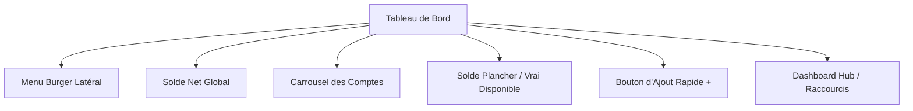

# Manuel d'Utilisation Complet et Exhaustif — Budgetizer 💰

Bienvenue dans **Budgetizer**, votre plateforme de gestion financière personnelle. Que vous souhaitiez simplement suivre vos dépenses au jour le jour, planifier vos futurs projets d'épargne, maîtriser vos budgets par enveloppes ou modéliser la résilience à long terme de votre patrimoine, ce manuel est conçu pour vous accompagner pas à pas.

Ce guide adopte une approche **chronologique et pédagogique** pensée pour un nouvel utilisateur. Il détaille l'intégralité des fonctionnalités, la signification de chaque indicateur ou graphique, ainsi que chaque interaction tactile et raccourci disponible.

---

## Sommaire

1. [Premiers pas : Authentification, Sécurité et Installation](#1-premiers-pas--authentification-sécurité-et-installation)
2. [Découverte du Tableau de Bord (Dashboard)](#2-découverte-du-tableau-de-bord-dashboard)
3. [Mise en place de votre structure financière (Comptes, Catégories, Tags)](#3-mise-en-place-de-votre-structure-financière-comptes-catégories-tags)
4. [Saisie et suivi des mouvements au quotidien](#4-saisie-et-suivi-des-mouvements-au-quotidien)
5. [Planification : Budgets (Enveloppes) et Abonnements](#5-planification--budgets-enveloppes-et-abonnements)
6. [Épargne et Réalisation de Projets](#6-épargne-et-réalisation-de-projets)
7. [Analyses Graphiques Avancées](#7-analyses-graphiques-avancées)
8. [Pilotage Proactif : Rapports Mensuels & Tachymètre de Vélocité](#8-pilotage-proactif--rapports-mensuels--tachymètre-de-vélocité)
9. [Sauvegarde, Export PDF Premium et Paramètres Généraux](#9-sauvegarde-export-pdf-premium-et-paramètres-généraux)

---

## 1. Premiers pas : Authentification, Sécurité et Installation

### 1.1 Inscription et première configuration
Lorsque vous lancez l'application pour la première fois :
* **Créer un compte** : Cliquez sur *"S'inscrire"*. Renseignez votre nom complet, votre adresse e-mail et un mot de passe sécurisé (6 caractères minimum).
* **Initialisation automatique** : Dès la validation de votre inscription, Budgetizer génère automatiquement un jeu de catégories par défaut (Alimentation, Logement, Transports, Loisirs, etc.) et configure vos préférences initiales (devise en Euro `€`, thème sombre premium, et premier jour de la semaine fixé au lundi) afin que vous puissiez utiliser l'application immédiatement.

### 1.2 Authentification Biométrique (Passkeys / Clés d'accès)
Budgetizer utilise la technologie standard **WebAuthn (Passkeys)** pour vous permettre de vous connecter de manière ultra-sécurisée sans saisir de mot de passe.
* **Invite proactive à l'activation** : Juste après votre première connexion réussie par mot de passe, si votre navigateur ou appareil supporte la biométrie (Touch ID, Face ID, Windows Hello, code PIN système), une boîte de dialogue (Modal) s'affiche à l'écran pour vous proposer d'activer la connexion biométrique. 
* **Enregistrement de l'appareil** : Si vous acceptez, validez via le capteur d'empreinte ou de reconnaissance faciale de votre système. Budgetizer enregistre votre appareil sous un nom convivial détecté automatiquement (ex. : *"Windows (Chrome)"* ou *"iOS (Safari)"*). Vous pouvez gérer vos appareils de confiance à tout moment dans les Paramètres.
* **Connexion en un clic** : Lors de vos visites ultérieures, cliquez simplement sur le bouton **Se connecter avec la biométrie** situé sous le formulaire. Votre session s'ouvrira instantanément après confirmation biométrique locale.
* **Bouton d'urgence (Réinitialisation de l'appareil)** : Si un dysfonctionnement survient (Passkey supprimé sur l'appareil mais toujours attendu par le serveur), cliquez sur le lien sous le formulaire : *"Problème avec la biométrie ? Réinitialiser l'appareil"*. Cela nettoiera l'état local du périphérique pour vous permettre de vous reconnecter par mot de passe classique et de réenregistrer proprement votre clé.

### 1.3 Installation PWA (Progressive Web App) et mode Hors Ligne
Budgetizer est conçu comme une application web progressive, ce qui signifie qu'elle peut s'installer sur votre téléphone ou votre ordinateur comme une application native.
* **Bannière d'installation dynamique** : 
  * *Sur Google Chrome / Microsoft Edge (PC et Android)* : Un bandeau s'affiche automatiquement en bas de l'écran ou dans les paramètres pour installer l'application. Cliquez sur "Installer".
  * *Sur Apple iOS (Safari sur iPhone/iPad)* : En raison des contraintes d'Apple, la bannière d'installation affiche des instructions explicites. Appuyez sur l'icône de partage de Safari (le carré avec une flèche vers le haut), faites défiler vers le bas et sélectionnez **Sur l'écran d'accueil**.
* **Détection automatique de connexion réseau** :
  * Si vous perdez votre connexion internet (tunnel, zone blanche), un **Toast rouge** glisse depuis le haut de l'écran : *"Mode hors ligne — Utilisation des données en cache"*. L'application reste pleinement consultable.
  * Dès que le réseau est de retour, un **Toast vert** apparaît : *"Connexion rétablie — Synchronisation réussie"*. Les données sont instantanément rafraîchies depuis le serveur de manière transparente.

---

## 2. Découverte du Tableau de Bord (Dashboard)

Le tableau de bord centralise toutes les informations cruciales concernant votre santé financière.



### 2.1 Le Menu de Navigation Latéral (Tiroir Burger) & En-tête Collante
* **Accès au Menu** : Cliquez sur les trois lignes horizontales (Menu Burger) en haut à gauche de l'écran.
* **Esthétique & Navigation** : Ce tiroir borderless glisse sur le côté gauche, appliquant un flou d'arrière-plan (`backdrop-blur`) et intégrant des reflets lumineux discrets (glow flares). Il réorganise les fonctionnalités de manière ergonomique par fréquence d'usage :
  1. **Mon Quotidien** (Haute fréquence) : Tableau de bord, Comptes, Transactions, Virements instantanés.
  2. **Mon Budget & Projets** (Moyenne fréquence) : Budgets, Objectifs d'épargne, Planifications.
  3. **Analyses & IA** (Analyses & conseils) : Graphiques, Rapport Mensuel, Conseils IA, Scores financiers.
  4. **Outils & Options** (Occasionnel) : Simulateur de prêt, Exporter un rapport, Mon Profil & Paramètres.
* **Barre d'en-tête collante (Sticky Header)** : Pour assurer une navigation fluide, la barre supérieure (contenant le menu burger ou le bouton de retour selon le contexte, ainsi que le titre de la page) reste fixée tout en haut de l'écran lorsque vous faites défiler la page vers le bas.

### 2.2 Consulter le Solde Global (Net Worth)
* **Affichage** : Tout en haut, le montant principal représente votre valeur nette globale (la somme des soldes de vos comptes actifs inclus dans le calcul).
* **Geste interactif** : **Tapez ou cliquez sur ce montant global** pour déclencher une infobulle (Toast) détaillant la composition exacte de cette somme (ex. : la part d'argent disponible liquide vs le montant total de vos dettes de crédits).

### 2.3 Le Carrousel tactile des Comptes
* **Affichage** : Une bande horizontale présente vos comptes bancaires sous forme de cartes colorées premium.
* **Geste interactif (Snap Scroll)** : Faites glisser horizontalement les cartes avec votre doigt. Elles se recentrent automatiquement (snap scroll).
* **Codes visuels des cartes** :
  * Les soldes positifs s'affichent dans une police de chiffres tabulaires à fort contraste (`.font-premium-numbers`). S'ils sont négatifs, ils passent automatiquement en rouge vif.
  * Chaque carte bénéficie d'un style glassmorphic brillant (`.bg-surface-glass` et `.backdrop-blur-md`) avec des reflets et des bordures semi-transparentes (`border-white/10`).
  * Chaque carte arbore une icône adaptée à son type (ex. : 💼 pour un compte courant, 🐷 pour l'épargne, 📈 pour les investissements).
  * Un voyant vert clignotant animé (`.animate-pulse-live`) accompagné du label `Live` en haut à droite indique la date et l'état de synchronisation en temps réel du compte.
* **Gestes interactifs sur les cartes** :
  * **Tapez sur une carte standard** (courant, épargne, espèces) pour ouvrir le formulaire de modification de ce compte ou consulter son détail de transactions.
  * **Tapez sur une carte de crédit (bordeaux / rouge foncé)** pour être automatiquement redirigé vers sa page d'analyse de prêt dédiée.

### 2.4 Le Solde Plancher (Vrai Disponible) 📉
Situé juste sous le solde global de votre compte courant principal, cet indicateur recalcule la somme réellement utilisable après déduction de vos factures et charges à venir d'ici votre prochaine rentrée d'argent.
* **Pastille de diagnostic** : Elle s'affiche en **Vert** si votre disponible réel représente plus de 20% de votre solde réel. Elle passe à l'**Orange** ou au **Rouge** si le risque de découvert d'ici la paie est avéré.
* **Mini-graphique interactif (Sparkline)** : Glissez votre doigt sur la courbe pour inspecter l'évolution projetée de votre solde jour après jour sur les 30 prochains jours. Une ligne pointillée rouge horizontale matérialise le seuil critique de `0 €`.
* **Configuration (icône d'engrenage)** : Cliquez dessus pour définir manuellement le jour de versement récurrent de votre salaire mensuel (ou laissez le système le détecter automatiquement depuis votre échéancier).
* **Accordéon pliable des charges** : Dépliez la liste au bas de la carte pour voir le détail des factures attendues. **Cochez ou décochez une charge** : si vous l'avez payée en avance ou par un autre moyen, son exclusion réajuste instantanément et dynamiquement le montant de votre Vrai Disponible.

### 2.5 Raccourcis tactiles (Dashboard Hub)
Située au cœur du tableau de bord, cette barre de raccourcis sur une seule ligne vous offre un accès direct aux 4 services primaires de l'application : Budgets, Épargne, Analyses, Conseils.
Un 5ème bouton **Plus** (trois points) permet d'ouvrir un tiroir coulissant (BottomSheet) contenant les raccourcis secondaires : Abonnements, Scores, Échéances, Virements. Ce format compact allège considérablement l'affichage sur mobile.

### 2.6 La Carte des Statistiques Temporelles (Ce mois / Cette semaine) 📊
Ce composant réunit vos indicateurs de suivi du temps dans une unique carte dotée d'un sélecteur d'onglets pour économiser de la hauteur d'écran :
* **Onglet "Ce mois"** : Affiche vos Revenus, vos Dépenses et votre Solde Net mensuel avec le pourcentage d'évolution (hausse ou baisse) par rapport au mois précédent.
* **Onglet "Cette semaine"** : Affiche le montant cumulé de vos dépenses sur les 7 derniers jours glissants et un mini-graphique (Sparkline de type courbe d'aire) reflétant leur évolution au fil des jours.

---

## 3. Mise en place de votre structure financière (Comptes, Catégories, Tags)

Avant de saisir des écritures, vous devez configurer vos structures financières.

### 3.1 Création et édition de Comptes Standards
Rendez-vous dans la rubrique **Comptes** du menu latéral :
* **Ajouter un compte** : Cliquez sur le bouton `+` en haut à droite.
* **Champs requis** : Saisissez son nom, le solde initial réel, et sélectionnez une couleur thématique ainsi qu'une icône représentative.
* **Option d'inclusion** : La case à cocher *"Inclure dans le Total"* détermine si le solde de ce compte impacte le Net Worth global du Dashboard. Décochez-la pour les comptes d'investissements bloqués ou d'épargne long terme afin de ne pas fausser votre trésorerie courante.
* **Geste interactif (Tri par Glisser-Déposer / Drag & Drop)** : Sur l'écran de liste des comptes, **maintenez votre doigt appuyé** sur les deux lignes horizontales d'une ligne de compte et faites-la glisser vers le haut ou le bas. Cette réorganisation change instantanément l'ordre d'affichage des cartes dans le carrousel du Dashboard.
* **Suppression** : Ouvrez le formulaire de modification du compte et cliquez sur le bouton de suppression rouge.
  > [!WARNING]
  > Confirmez avec précaution. La suppression d'un compte efface définitivement toutes les transactions, abonnements et échéances qui lui sont associés.

### 3.2 Configuration avancée des Comptes de Crédit / Prêt 🏦
Si vous avez contracté un emprunt (immobilier, automobile ou à la consommation) :
1. Créez un compte et sélectionnez le type **Crédit**. Le système l'initialisera avec un solde négatif correspondant au capital emprunté restant dû.
2. Remplissez les paramètres :
   * **Capital emprunté** (ex. : `200 000 €`).
   * **Taux d'intérêt annuel (%)** (ex. : `3.5 %`).
   * **Durée en mois** (ex. : `240 mois`).
   * **Date de première mensualité** et **Compte source de prélèvement** (le compte courant sur lequel le prélèvement automatique sera effectué).

#### Calcul de la mensualité et amortissement
Budgetizer calcule automatiquement la mensualité hors assurance $M$ selon la formule financière standard :
$$M = C \times \frac{r/12}{1 - (1 + r/12)^{-n}}$$
*(où $C$ est le capital emprunté, $r$ le taux annuel décimal, et $n$ la durée en mois. Si le taux est de 0 %, la mensualité est calculée via une simple division linéaire $C/n$)*.

#### Interactions avec la fiche de crédit
En cliquant sur une carte de crédit depuis le tableau de bord ou la page des comptes, vous ouvrez une interface de pilotage complète :
* **Graphique d'amortissement** : Une courbe d'aire colorée présente la réduction progressive de votre dette historique et projetée jusqu'à sa liquidation complète (retour à 0 €).
* **Widget d'échéance dynamique** : Visualisez la décomposition exacte de votre prochain prélèvement, indiquant précisément la part allouée au remboursement du capital amorti et la part absorbée par les intérêts payés.
* **Tableau d'amortissement complet** : Dépliez cet accordéon pour inspecter, ligne par ligne pour chaque mois du prêt, le montant de la mensualité, la part d'intérêt, la part de capital remboursé, la cotisation d'assurance et le capital restant dû.

```
Visualisation de la décomposition d'un versement de mensualité de crédit :
┌─────────────────────────────────────────────────────────┐
│ Mensualité Totale : 1 200,00 €                          │
├────────────────────────────┬────────────────────────────┤
│ Part Capital Remboursé     │ Part Intérêts Bancaires    │
│ (Réduit votre dette)       │ (Frais perdus)             │
│ 850,00 € [Vert]            │ 350,00 € [Orange]          │
└────────────────────────────┴────────────────────────────┘
```

> [!NOTE]
> Le remboursement de prêt a un **double impact comptable** : dans votre historique de compte courant, il s'affiche comme une dépense en négatif (prélèvement). Sur votre compte de crédit, il s'affiche en positif et en vert, car il s'agit d'un versement d'amortissement qui vient réduire le montant de votre dette.

### 3.3 Catégories et Sous-catégories
Les catégories classifient vos flux financiers.
* Associez-leur une couleur et une icône.
* Définissez si elles s'appliquent aux dépenses, aux revenus ou aux deux.
* Vous pouvez créer des sous-catégories enfants (ex. : *"Supermarché"* et *"Restaurant"* rattachés à la catégorie parente *"Alimentation"*).

### 3.4 Étiquettes (Tags) et archivage intelligent
Pour les projets transversaux (ex. : `#vacances 2026`, `#travaux`), créez des tags de couleur personnalisée dans la section **Tags**.
* **Archivage intelligent** : Une fois vos vacances terminées, ouvrez les paramètres du tag et cochez **Archiver l'étiquette**. 
* *Comportement* : Le tag n'apparaîtra plus dans les suggestions de saisie rapide au quotidien pour ne pas encombrer l'interface. Néanmoins, l'ensemble de votre historique passé et vos analyses graphiques restent parfaitement inchangés et complets.

---

## 4. Saisie et suivi des mouvements au quotidien

### 4.1 La Saisie Rapide et Progressive (Bottom Sheet)
* **Ouverture** : Cliquez sur le bouton flottant d'action central `+` au bas de l'écran. Un tiroir interactif (Bottom Sheet) se déploie depuis le bas.
* **Balayage tactile (Swipe-to-Dismiss)** : Sur mobile, vous pouvez fermer ce tiroir à tout moment d'un simple mouvement du doigt en le faisant glisser vers le bas de plus de 100 px.
* **Fonctionnement progressif en Deux Étapes** : Le formulaire est structuré en deux étapes pour optimiser l'espace écran et réduire la gêne occasionnée par l'ouverture du clavier mobile :
  * **Étape 1 (Saisie du Montant)** : 
    * Saisissez la somme à enregistrer. Sur mobile, le pavé numérique décimal s'affiche automatiquement.
    * Un indicateur de solde résultant s'affiche en temps réel sous le montant (vert s'il est créditeur, rouge s'il risque de vous faire passer en découvert).
    * **Chip "🔁 Répéter la dernière transaction"** : Permet de cloner et de pré-remplir l'intégralité du dernier enregistrement en un seul tap.
    * **Favoris rapides (templates)** : Accédez à vos puces de favoris configurées (boutons de taille confortable de plus de 44 px) pour saisir vos dépenses quotidiennes instantanément. Vous pouvez supprimer un favori en restant appuyé longuement dessus (appui tactile prolongé).
    * Sélectionnez le type (Revenu ou Dépense) puis appuyez sur **Continuer** pour passer à l'étape suivante.
  * **Étape 2 (Détails de la Transaction)** :
    * **Suggestions et Pré-catégorisation intelligente (IA)** : Saisissez la note (description/nom du marchand). Dès 2 caractères saisis, l'application propose des complétions basées sur votre historique récent. De plus, Budgetizer analyse automatiquement votre saisie de note pour identifier la catégorie passée la plus probable et la pré-sélectionne à la volée. Un badge d'IA avec l'étiquette `Suggéré` apparaît alors juste au-dessus du sélecteur de catégorie. Si vous décidez de changer manuellement de catégorie ou d'utiliser un favori, l'auto-suggestion se désactive et le badge disparaît.
    * **Sélecteurs tactiles Compte et Catégorie** : Cliquer sur l'un d'eux ouvre un panneau coulissant complet. Une barre d'onglets `[Compte] [Catégorie]` en haut vous permet de passer directement de l'un à l'autre sans faire de détours par le formulaire principal.
    * **Indicateur de budget en ligne** : Si la catégorie choisie dispose d'une enveloppe de budget configurée, une barre de progression s'affiche pour vous indiquer le niveau de consommation actuel et l'impact du montant que vous êtes en train de saisir, avec une alerte visuelle en cas de dépassement.
    * **Date en accordéon** : Cachée par défaut sous le bouton *"📅 Aujourd'hui"*, déroulez l'accordéon uniquement si vous souhaitez modifier la date de l'opération.
    * Ajoutez des tags et validez à l'aide du bouton sticky resté visible en bas du formulaire.
* **Confirmation et retours haptiques** : 
  * Un toast de succès vert apparaît en haut de l'écran pendant 3 secondes pour récapituler le montant enregistré et afficher le nouveau solde du compte.
  * Votre appareil mobile émet des vibrations caractéristiques (1 vibration brève pour une dépense, 2 vibrations légères rythmées pour un revenu, et 3 secousses marquées en cas d'erreur de saisie).

### 4.2 Le Journal des Transactions (Historique)
Dans le menu **Transactions**, suivez l'ensemble de vos écritures passées.
* **Regroupement par date intelligent** : Les transactions sont regroupées par jour. Les en-têtes de groupe s'affichent en couleur :
  * **"Aujourd'hui"** → en couleur accent (bleu-violet) pour ressortir immédiatement.
  * **"Hier"** → en couleur primaire.
  * Jours antérieurs → en couleur secondaire discrète.
* **Indicateur de Catégorie & Bordure Colorée (Left-Border)** : Pour faciliter le scan visuel rapide, chaque ligne de transaction dispose d'une fine bordure verticale gauche de 4px reprenant le code couleur de son compte ou de sa catégorie. De plus, l'icône de sa catégorie (ex : 🍔, 🏠, 🛒) ou de son type (ex : 🔄 pour les virements, ❓ pour les éléments non classés) s'affiche sur un arrière-plan en dégradé de couleur translucide et une bordure assortie.
* **Typographie Premium & Contraste des Montants** : Les montants sont formatés avec la police `.font-premium-numbers` en taille `text-sm sm:text-base` et en graisse `font-extrabold`. Les revenus s'affichent en vert émeraude et les débits importants de dépassement de seuil s'affichent en rouge vif, tandis que les dépenses régulières s'affichent de façon plus sobre en blanc/bleuté pour ne pas surcharger l'écran.
* **Gestes de modification et de suppression** :
  * *Sur ordinateur (PC/Mac)* : Cliquez sur la ligne de la transaction pour ouvrir le formulaire d'édition.
  * *Sur smartphone/tablette* : **Faites glisser votre doigt vers la gauche (Swipe Left)** sur la ligne de transaction pour révéler **deux boutons** :
    * ✏️ **Modifier** (bleu accent) — ouvre directement le formulaire pré-rempli de la transaction.
    * 🗑️ **Supprimer** (rouge) — supprime immédiatement la transaction.
* **Filtres** : Filtrez par période, catégorie, tag ou compte bancaire.

### 4.3 Virements Instantanés Internes (Transfers)
Pour déplacer de l'argent entre vos propres comptes physiques (ex. : alimenter votre Livret d'épargne depuis votre Compte Courant) :
1. Accédez à la page **Virements instantanés**.
2. Sélectionnez le compte à débiter et le compte à créditer.
3. Saisissez le montant et une note descriptive facultative.
4. **Validation sécurisée** : Cliquez sur *"Confirmer le virement"*. Une boîte de dialogue s'affiche pour vous montrer un **aperçu comparatif avant/après** de vos soldes bancaires sur les deux comptes concernés pour éliminer tout risque d'erreur de transfert.
5. Cliquez sur *"Valider"* pour exécuter le mouvement de fonds. Vous pouvez l'annuler à tout moment dans l'historique des virements récents pour restaurer instantanément les soldes précédents.

```
Aperçu interactif avant virement de 500 € :
Compte Courant : 2 500 € ───[Débit de 500 €]───> Nouveau Solde : 2 000 € [Rouge]
Compte Épargne : 5 000 € ───[Crédit de 500 €]───> Nouveau Solde : 5 500 € [Vert]
```

### 4.4 Le Calendrier des Transactions (Calendar)
Le module **Calendrier** offre une vision temporelle globale de vos finances.
* Sélectionnez un mois à l'aide des flèches directionnelles `←` et `→` en haut de page.
* Les jours contenant des flux sont marqués d'indicateurs visuels.
* Tapez sur un jour pour voir s'afficher la liste des transactions de cette date spécifique au bas du calendrier.
* Les **transactions planifiées récurrentes** (échéances à venir) s'affichent avec un fond violet distinctif et un badge `"Planifié"`.

---

## 5. Planification : Budgets (Enveloppes) et Abonnements

### 5.1 La Méthode des Enveloppes Budgétaires
Cette technique éprouvée consiste à allouer une somme limite mensuelle, hebdomadaire ou annuelle à une catégorie spécifique (ex. : `400 € / mois` pour l'Alimentation).
* **Création** : Dans la section **Budgets**, cliquez sur `+` et définissez la catégorie, le montant limite et la périodicité.
* **Option de report (Rollover)** : Activez le report pour que le solde restant non consommé (économie) s'ajoute au budget du mois suivant. Si vous êtes en dépassement (déficit), le montant du dépassement sera déduit de votre enveloppe du mois suivant pour compenser l'écart.
* **Lecture visuelle de la barre de progression** :
  * **Vert** : Moins de 80 % du budget consommé. Tout est sous contrôle.
  * **Orange** : Entre 80 % et 100 % consommé. Vigilance requise.
  * **Rouge** : Budget dépassé. L'enveloppe est vide.
* **Geste interactif (Drill-down)** : Cliquez ou tapez directement sur la barre de progression d'un budget pour ouvrir instantanément la liste détaillée de toutes les transactions réelles qui ont consommé cette enveloppe depuis le début de la période.

### 5.2 Planifications et Échéancier
Pour anticiper vos dépenses et revenus récurrents (loyer, abonnements, salaire), configurez une planification :
* **Fréquence** : Indiquez l'intervalle (ex. : toutes les 2 semaines, tous les mois).
* **Gestion intelligente des fins de mois** : Si vous configurez une récurrence le 31 du mois, Budgetizer ajuste automatiquement la date lors des mois plus courts (le 30 avril ou le 28/29 février) et repasse automatiquement au 31 dès que le mois le permet, évitant ainsi les décalages progressifs de date.
* **Mode d'exécution** :
  * **Auto-confirmer = Activé** : Dès que l'échéance arrive, la transaction est enregistrée en historique et vos soldes sont ajustés automatiquement.
  * **Auto-confirmer = Désactivé** : La transaction apparaît sous le statut **"À confirmer"**. Vous devez valider manuellement son prélèvement effectif en ajustant le montant si nécessaire, ou choisir de l'ignorer.

### 5.3 Suivi des Abonnements (Subscriptions)
Le panneau **Abonnements** regroupe tous vos contrats et charges récurrentes actives (Netflix, électricité, salle de sport).
* **Indicateur de charge fixe** : Il affiche en haut de page le cumul de vos abonnements traduits en **coût mensuel total** et **coût annuel total** pour vous faire prendre conscience du poids de vos charges contractuelles.
* **Lien avec les Crédits** : Les abonnements créés automatiquement suite à la configuration d'un compte de type Crédit affichent un badge spécial `"🏦 Crédit"`. Ces planifications ne sont pas modifiables directement ici : cliquez sur le lien associé pour être automatiquement redirigé vers les paramètres de votre compte de crédit.

---

## 6. Épargne et Réalisation de Projets

L'onglet **Épargne** vous aide à concrétiser vos projets financiers (ex. : "Apport immobilier", "Fonds d'urgence").
* **Créer un objectif** : Renseignez le nom du projet, son montant cible, sa date limite et associez-lui une icône et une couleur. Budgetizer calculera automatiquement l'effort d'épargne mensuel nécessaire pour atteindre le but dans les temps.
* **Association bancaire (Réelle vs Virtuelle)** :
  * **Compte d'épargne physique lié** : Associez votre objectif à un compte d'épargne réel (ex. : votre Livret A). Les versements effectués vers cet objectif déclencheront de vrais virements bancaires internes depuis votre compte courant vers ce Livret A. Vos progressions d'objectifs et vos soldes réels sont synchronisés.
  * **Objectif virtuel (sans compte lié)** : Le versement d'épargne est traité comme une dépense virtuelle. L'argent est comptabilisé comme "bloqué" pour masquer ce montant de votre solde disponible et simuler l'épargne sans ouvrir de compte réel.

---

## 7. Analyses Graphiques Avancées

Les graphiques interactifs transforment vos données financières brutes en informations stratégiques.

### 7.1 Répartition catégorielle (Pie Chart)
* **Visualisation** : Un camembert dynamique présente le pourcentage de vos dépenses par catégorie.
* **Geste interactif** : Cliquez ou tapez sur un secteur du camembert pour centrer le secteur et afficher son montant exact en euros au milieu du graphique.

### 7.2 Graphique de Cascade (Waterfall) 📊
Accessible dans l'onglet Analyses sous le nom *"Analyse mensuelle"*, ce graphique présente les flux financiers du mois sous forme de cascade.

```
Illustration du graphique en cascade (Waterfall) :
  Revenus (+ 3 000 €)  ───┐ [Vert]
                          ├─── Logement (- 1 200 €) ───┐ [Rose]
                                                       ├─── Alimentation (- 400 €) ───┐ [Rose]
                                                                                      └─── Solde Restant : Épargne Nette (+ 1 400 €) [Violet]
```

* **Lecture de gauche à droite** :
  1. La première colonne à gauche (Verte) démarre à 0 et grimpe pour représenter vos **revenus totaux**.
  2. Les colonnes suivantes (Roses) sont "suspendues" et descendent marche par marche, représentant les dépenses de chaque catégorie (classées par ordre d'importance).
  3. La dernière colonne à droite représente le **solde net restant** (Violette pour une épargne positive, Rouge pour un déficit net).
* **Utilité** : Visualiser instantanément comment vos revenus sont absorbés par vos différents postes de dépenses pour finir le mois.

### 7.3 Graphique Fixes vs Variables 🔒🎲
Ce graphique segmente vos dépenses pour identifier la part sur laquelle vous pouvez agir.
* **Règle de classification automatique** :
  * **Charges Fixes (🔒 / Indigo)** : Dépenses programmées incompressibles (loyer, abonnements, impôts, crédits configurés dans l'échéancier).
  * **Dépenses Variables (🎲 / Ambre)** : Dépenses spontanées ou discrétionnaires saisies manuellement (sorties, courses courantes, shopping).
* **Interactions** : 
  * Un Donut animé à deux arcs (Indigo et Ambre) affiche le ratio en %. Glissez votre souris ou tapez sur un arc pour révéler le montant absolu.
  * Dépliez les listes collapsables au bas du graphique pour inspecter quelles catégories consomment le plus de frais fixes ou de dépenses variables.

### 7.4 Simulation de Monte-Carlo (Stress-Test de Résilience)
Ce module mathématique avancé projette la viabilité de votre patrimoine sur le long terme (de 5 à 40 ans) en exécutant en local dans votre navigateur **1 000 trajectoires de simulation aléatoires** (processus stochastique). Chaque scénario injecte de la volatilité de marché, de l'inflation et d'éventuels coups durs financiers.

* **Curseurs de configuration (⚙️)** : Dépliez le panneau pour ajuster vos paramètres :
  * **Capital initial** et **Épargne mensuelle** (calculés automatiquement sur votre situation réelle, mais modifiables).
  * **Profil d'investissement** : Boutons de sélection rapide :
    * *Prudent* (rendement moyen de 2,5 % / volatilité de 2 %).
    * *Équilibré* (rendement moyen de 5 % / volatilité de 8 %).
    * *Dynamique* (rendement moyen de 8 % / volatilité de 16 %).
  * **Inflation estimée** et indexation de votre épargne.
  * **Stress-test "coups durs"** : Spécifiez la probabilité annuelle d'un incident majeur (maladie, sinistre, perte d'emploi) et son coût financier moyen.
* **Interprétation des résultats et du graphique** :
  * **La ligne centrale pleine** représente la trajectoire médiane (50e percentile : le scénario le plus probable).
  * **La zone translucide verte** représente l'entonnoir d'incertitude délimité par le pire scénario (10e percentile : vous avez 90 % de chances de faire mieux) et le meilleur scénario (90e percentile : vous avez 10 % de chances de l'atteindre).
  * **Score de résilience** : Indique le pourcentage de trajectoires simulées où votre capital reste positif à l'échéance. Un diagnostic est attribué (*Excellent*, *Correct* ou *Vulnérable*) avec une estimation du nombre moyen d'années avant rupture financière en cas de vulnérabilité.

---

## 8. Pilotage Proactif : Rapports Mensuels & Tachymètre de Vélocité

### 8.1 Le Rapport Mensuel Proactif (Déterministe)
Chaque début de mois, Budgetizer génère un rapport d'analyse complet et objectif, disponible dans l'onglet **Rapports**. Il fonctionne entièrement hors ligne sans outil d'IA externe.
* **Bilan Général** : Affiche vos revenus, vos dépenses, votre taux d'épargne et compare le volume global de vos dépenses avec le mois précédent en %.
* **Les Victoires 🎉** : Met en avant vos bons comportements (ex. : enveloppe budgétaire respectée, baisse significative des dépenses sur une catégorie d'au moins 15 % par rapport à l'historique, objectif d'épargne complété).
* **Les Points de Vigilance ⚠️** : Identifie les dérives (ex. : dépassement de budget de catégorie, hausse catégorielle de plus de 30 % ou souscription à un nouvel abonnement).
* **Dépenses Inhabituelles Détectées** : L'algorithme liste toutes les dépenses unitaires qui sortent de vos habitudes de consommation.
  * *Règles de détection* : Une transaction est signalée comme "inhabituelle" si son montant est **supérieur ou égal à 50 €** et qu'il dépasse **au moins 3 fois** la moyenne historique mensuelle de sa catégorie sur les 3 derniers mois.
  * *Affichage* : Les transactions suspectes sont présentées sous forme de cartes affichant un badge de ratio d'écart (ex. : `"4.5x la moyenne"`), triées de la plus déviante à la moins déviante.

### 8.2 Le Tachymètre : Vitesse de Dépense (Spending Velocity) 🏎️
Cet indicateur en forme de compteur de vitesse de voiture (jauge) vous indique en temps réel si vous consommez vos budgets mensuels trop rapidement par rapport aux jours restants dans le mois.

```
Tachymètre de Vélocité Budgétaire :
               [  Aiguille Animée  ]
                      /
        Zone Verte   /    Zone Rouge
      (Sous Contrôle)    (Excès de vitesse !)
      [ 0 € ───────── 🚗 ───────── 150 € / jour ]
```

* **Méthode de calcul** :
  1. **Vitesse Cible** : La limite quotidienne conseillée ($BudgetRestant / JoursRestants$).
  2. **Vitesse Réelle** : La moyenne de vos dépenses réelles par jour sur les 7 derniers jours.
  3. **Estimation du crash** : Si votre vitesse réelle dépasse la vitesse cible, le système estime la date précise d'épuisement complet de votre budget.
* **Lecture de la jauge** :
  * **Zone verte** (à gauche) : Votre vitesse réelle est inférieure à la limite. Le diagnostic indique *"Vitesse sous contrôle"*.
  * **Zone rouge** (à droite) : L'aiguille bascule vers la droite. Le diagnostic affiche *"⚠️ Excès de vitesse détecté"* et calcule la date d'épuisement théorique.
  * **Conseil correctif** : Une fiche d'aide recalcule en direct la nouvelle limite quotidienne à ne pas dépasser pour le reste du mois pour redresser la barre et finir dans le vert. Si le budget est déjà épuisé, la limite corrective conseillée passe à `0 € / jour`.
* **Alerte Proactive de fin de mois difficile 🚨** :
  Si l'analyse de vélocité détecte que votre budget d'enveloppe sera entièrement épuisé **avant le 20 du mois en cours** :
  1. Une alerte ornée d'une icône de flamme rouge (`Flame`) est poussée dans le centre de notifications de votre tableau de bord.
  2. Si vous utilisez l'application PWA installée, une **Notification Push native** est directement envoyée sur l'appareil de l'utilisateur pour le prévenir instantanément.

---

## 9. Sauvegarde, Export PDF Premium et Paramètres Généraux

### 9.1 Import et Export de données
Pour vous assurer de garder le contrôle total de vos données financières personnelles :
* **Exporter** : Dans les paramètres, choisissez le format **CSV** ou **JSON** pour télécharger l'intégralité de vos écritures bancaires et paramétrages sur votre appareil.
* **Importer** : Glissez-déposez ou sélectionnez un fichier CSV de transactions pour peupler instantanément vos comptes et graphiques.

### 9.2 Génération de Rapports PDF Premium 📊📄
Depuis l'onglet **Rapports**, configurez et exportez des rapports d'activité au format PDF A4 haute définition, parfaits pour l'impression ou l'archivage.
* **Options de personnalisation** : Cochez ou décochez les modules à inclure (graphique en cascade, ratio fixes vs variables, prévisions à 30 jours, journal complet des transactions).
* **Mise en page Premium (A4)** :
  * **Page de garde automatique** intégrant le logo officiel en Base64 pour éviter les erreurs d'affichage, vos métadonnées personnelles (nom, volume d'écritures) et les dates d'analyse.
  * **Priorité aux notes personnelles** : Les tableaux du PDF privilégient vos notes personnelles et explicites (ex. : *"Restaurant avec Marie"*) plutôt que la catégorie brute ou l'intitulé technique.
  * **Zéro page blanche** : L'algorithme de Budgetizer gère dynamiquement la hauteur des composants et force les sauts de page CSS (`page-break-after: always`) uniquement entre les chapitres pour garantir un rendu propre, sans page finale vide.
  * **Compatibilité Mobile** : Le PDF généré s'ouvre automatiquement dans un nouvel onglet de votre navigateur mobile pour faciliter sa sauvegarde ou son partage.

### 9.3 Configuration Générale & Profil
Dans la rubrique **Paramètres**, personnalisez vos options courantes :
* **Profil** : Modifiez votre nom d'affichage ou mettez à jour votre mot de passe d'accès.
* **Préférences** : Thème d'affichage (Clair, Sombre ou Système), devise par défaut, format de date et premier jour de la semaine (lundi ou dimanche).
* **Sensibilité de détection des anomalies** : Réglez le curseur de sensibilité (par défaut fixé à +30 %). C'est ce seuil qui déclenchera les alertes d'anomalies de dépenses sur votre espace *Conseils*.

### 9.4 La Zone de Danger (Danger Zone)
Au bas des paramètres se trouvent les options irréversibles :
* **Effacer les données** : Supprime l'ensemble de vos comptes bancaires, transactions, budgets et objectifs pour vous permettre de repartir de zéro, tout en conservant vos identifiants de connexion et votre profil.
* **Supprimer le compte** : Supprime définitivement votre compte utilisateur ainsi que l'ensemble des données associées de la base de données de Budgetizer (conformité totale RGPD). Cette action est définitive et irréversible.
